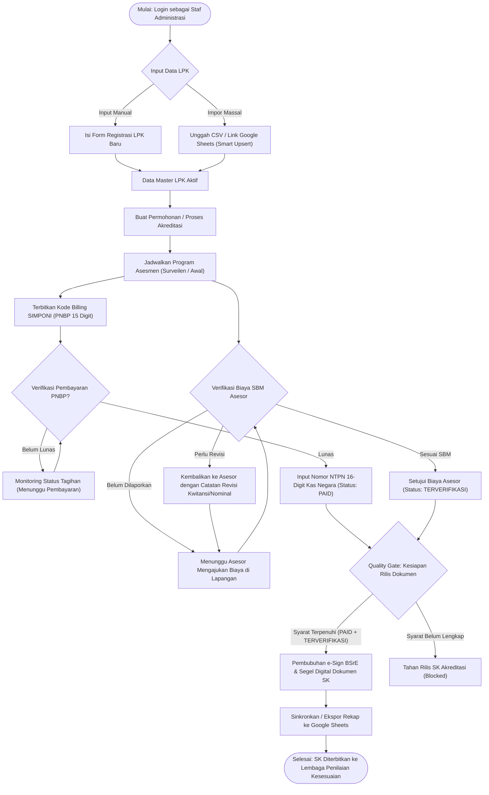
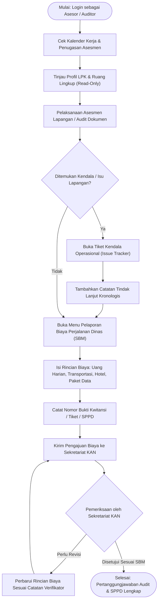
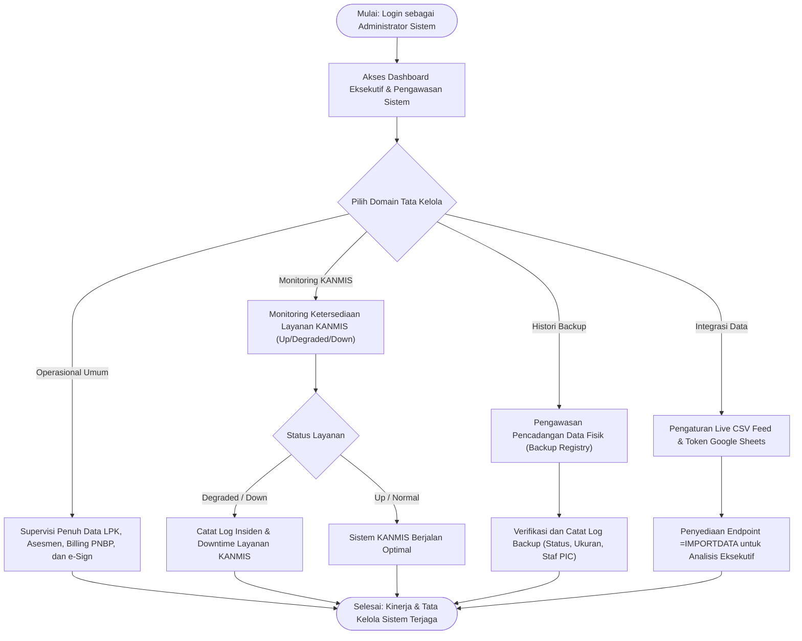

# SIMASADI
### Sistem Informasi dan Administrasi Akreditasi
**Badan Standardisasi Nasional (BSN) / Komite Akreditasi Nasional (KAN)**

SIMASADI adalah workspace operasional terpadu berbasis web yang dirancang untuk memantau, mengelola, dan memvalidasi alur kerja administrasi akreditasi Lembaga Penilaian Kesesuaian (LPK), program asesmen, pelaporan masalah, pengajuan amandemen, agenda kalender kerja, serta pemantauan layanan pendukung (KANMIS) dan histori pencatatan backup.

Aplikasi ini dikembangkan sebagai prototype lokal berkinerja tinggi guna mengeksplorasi antarmuka modern yang responsif, adaptif lintas perangkat, dan ramah pengguna sebelum terhubung ke sistem backend resmi.

---

## 📚 Dokumentasi Perancangan Sistem (SDLC)

Seluruh rancangan sistem telah disusun secara komprehensif mengikuti standar siklus hidup pengembangan perangkat lunak (SDLC) dan dapat diakses pada folder [`docs/`](docs/):

* 📑 **[Dokumen Master: PERANCANGAN_SISTEM.md](docs/PERANCANGAN_SISTEM.md)** — Rangkuman utuh seluruh perancangan sistem SIMASADI.
* 🌐 **[Bagian 1: Gambaran Umum Website](docs/01-gambaran-umum.md)** — Latar belakang KAN/BSN, tujuan, ruang lingkup (*in-scope* & *out-of-scope*), profil aktor sistem, dan arsitektur umum.
* 📅 **[Bagian 2: Tahap Perencanaan (Planning)](docs/02-tahap-perencanaan.md)** — Metodologi Iterative Agile Prototyping, linimasa pengembangan fase 1–6, studi kelayakan teknis/operasional, serta analisis risiko & mitigasi.
* 🔍 **[Bagian 3: Tahap Analisis (Analysis)](docs/03-tahap-analisis.md)** — Analisis masalah dengan PIECES Framework & Fishbone Diagram, spesifikasi Kebutuhan Fungsional (`REQ-F-01` s/d `REQ-F-24`), dan Kebutuhan Non-Fungsional (`REQ-NF-01` s/d `REQ-NF-09`).
* 📐 **[Bagian 4: Tahap Perancangan (Design)](docs/04-tahap-perancangan.md)** — Struktur Navigasi (Sitemap), Use Case Diagram, Activity Diagrams, Sequence Diagrams, Entity Relationship Diagram (ERD 11 tabel), Class Diagram, dan Wireframes antarmuka desktop & mobile.
* 🧪 **[Bagian 5: Implementasi dan Pengujian](docs/05-implementasi-dan-pengujian.md)** — Spesifikasi teknologi, struktur direktori, detail implementasi komponen UI, matriks kasus uji otomatis PHPUnit (16 feature tests), uji responsivitas antarmuka manual, dan bukti hasil eksekusi uji.

---

## ✨ Fitur Utama Sistem

1. **Dashboard Metrik & Analisis:**
   * Ringkasan KPI instan (Total LPK, Akreditasi Aktif, Asesmen Terjadwal, Isu Terbuka).
   * Analisis visual status akreditasi dalam progress bar persentase proporsional.
   * Daftar cepat masalah prioritas tinggi dan aktivitas asesmen terbaru.
2. **Manajemen Data LPK:**
   * Pencatatan nomor registrasi, nama lembaga, kategori (LSPro, Lab Kalibrasi, Lab Uji, dll.), kota, provinsi, dan jumlah lingkup akreditasi.
   * Detail profil LPK terhubung ke riwayat proses akreditasi dan asesmen terkait.
3. **Proses Akreditasi & Program Asesmen:**
   * Pemantauan siklus akreditasi dengan tahapan monitoring dan tanggal target penyelesaian.
   * Penjadwalan asesmen surveilen, asesmen awal, dan penugasan asesor kepala (*lead assessor*).
4. **Kalender Kerja Interaktif:**
   * Visualisasi bulanan kegiatan kerja dengan penanda hari ini (*today*).
   * **Pembuatan agenda instan:** Klik langsung pada kotak tanggal tertentu pada kalender untuk membuka form tambah agenda dengan tanggal mulai dan tanggal selesai yang otomatis terisi.
   * Mode tampilan ganda: Mode Kalender Kotak dan Mode Agenda List (ramah ponsel).
5. **Pelaporan Masalah & Log Tindak Lanjut (*Issue Tracking*):**
   * Pelaporan kendala operasional berstatus (*Open, In Progress, Resolved*) dan berprioritas (*Low, Medium, High*).
   * Form pencatatan catatan tindak lanjut (*follow-up*) kronologis berantai.
6. **Pengajuan Amandemen:**
   * Administrasi permohonan amandemen ruang lingkup akreditasi berserta nomor surat pengajuan.
7. **Monitoring Layanan KANMIS & Histori Backup:**
   * Pencatatan status ketersediaan sistem KANMIS internal (*Up, Degraded, Down*).
   * Histori pencadangan data manual (*Success, Failed, Unknown*) beserta staf pencatat dan ukuran berkas.
8. **Pelaporan Biaya Perjalanan Dinas Asesor (*Cost Reporting* - Kepatuhan SBM):**
   * Pelaporan rincian biaya: Uang Harian, Transportasi (Tiket/Tol/BBM), Akomodasi/Hotel, dan Paket Data/Komunikasi per asesmen.
   * Status verifikasi kepatuhan: `Belum Dilaporkan`, `Menunggu Verifikasi SBM`, `Terverifikasi SBM`, dan `Perlu Revisi`.
   * Form input biaya dan modal verifikasi persetujuan oleh Sekretariat KAN mengacu pada Standar Biaya Masukan (SBM) Peraturan Menteri Keuangan.
9. **Realisasi Billing PNBP (SIMPONI Kemenkeu):**
   * Penerbitan Kode Billing SIMPONI 15 digit dan tarif PNBP jasa akreditasi sesuai PP PNBP BSN.
   * Masa berlaku pembayaran, status tagihan (`Belum Bayar`, `Terbayar`, `Kadaluarsa`).
   * Formulir simulasi pelunasan kas negara dengan pencatatan Nomor Transaksi Penerimaan Negara (NTPN 16-karakter) dan kanal perbankan.
10. **Tanda Tangan Elektronik Dokumen SK (e-Sign BSrE):**
   * Pembubuhan tanda tangan elektronik tersertifikasi Balai Sertifikasi Elektronik (BSrE - BSSN) atas nama Ketua Komite Akreditasi Nasional.
   * Visualisasi Segel Digital (*Digital Seal Badge*), NIP, nomor seri sertifikat, serta nilai hash SHA-256 integritas dokumen.
   * Pratinjau QR Code simulasi dan rute publik verifikasi keaslian dokumen SK (`/verify-sk/{hash}`).
11. **Quality Gate Kesiapan Terbit Output Akreditasi (*Release Readiness Gate*):**
   * Verifikasi otomatis kepatuhan administratif dan finansial: SK Akreditasi hanya dapat dirilis (`OUTPUT_RELEASED`) jika realisasi billing PNBP telah terbayar (`PAID`) dan seluruh biaya asesmen telah berstatus `TERVERIFIKASI`.
12. **Pengalaman Pengguna (UX) Modern & Bebas Slop:**
   * **Dual-Mode Tampilan:** Bebas beralih antara mode **Tabel** (padat dan tabular) dan mode **Grid Cards** (kartu visual 2-kolom terstruktur) dengan preferensi tersimpan di `localStorage`.
   * **Penataan Sejajar di Mobile:** Tombol filter dan toggle mode tabel/grid berdampingan rapi (sejajar) di layar ponsel (`<= 600px`).
   * **Mobile Filter Drawer:** Panel filter meluncur dari sisi kanan layar (*slide-out drawer*) mirip aplikasi native.
   * **Active Filter Chips:** Label indikator filter aktif yang dapat dihapus per kriteria secara instan.
   * **Tombol Detail Interaktif:** Aksi tombol badge ungu beranimasi panah pada tabel.
   * **Custom Searchable Select:** Dropdown pencarian opsi cepat tanpa ketergantungan library berat.
   * **Notifikasi Elegan:** Notifikasi toast dan dialog terpadu menggunakan SweetAlert2.
13. **Integrasi Google Sheets Live Sync (`=IMPORTDATA`) & Ekspor CSV:**
    * **Live Data Feed:** Endpoint CSV langsung untuk formula spreadsheet `=IMPORTDATA("http://.../feeds/expenses.csv?key=simasadi-live")` yang otomatis memperbarui data di Google Sheets secara real-time.
    * **Unduh CSV UTF-8 BOM:** Ekspor rekapitulasi Biaya Asesor (SBM), Data Master LPK, dan Program Asesmen yang langsung kompatibel dengan Microsoft Excel dan Google Drive.
    * **Modal Dialog 1-Klik:** Panduan 3-langkah cepat dan tombol salin formula ke papan klip (*clipboard*).
14. **Impor Massal Data Master LPK (Smart Upsert):**
    * **Dukungan Ganda:** Impor dari unggahan berkas `.csv` (koma maupun titik koma) atau penarikan langsung dari tautan publik Google Sheets via HTTP client.
    * **Pencegahan Duplikasi (Smart Upsert):** Pembaruan otomatis profil LPK jika Nomor Registrasi sudah ada, atau pembuatan catatan baru jika belum terdaftar.
    * **Template Resmi Siap Unduh:** Fasilitas pengunduhan file `template-import-lpk.csv` dengan contoh struktur data LPK nyata.

---

## 🔄 Alur Kerja Utama Berdasarkan Peran (Role-Based Flowcharts)

Aplikasi SIMASADI mengimplementasikan pemisahan hak akses dan tanggung jawab operasional (*Role-Based Access Control / RBAC*) yang ketat mengacu pada Standard Operating Procedure (SOP) Komite Akreditasi Nasional (KAN) dan Badan Standardisasi Nasional (BSN).

### 👥 Kredensial Akun Pengguna

| Peran (*Role*) | Akun Demo | Hak Akses Utama | Batasan Keamanan |
|---|---|---|---|
| **Staf Administrasi** | `staf@simasadi.local` | Registrasi & Impor LPK, Jadwal Asesmen, Amandemen, Billing PNBP, Verifikasi SBM, e-Sign SK | Ditolak (403) membuka menu teknis server (*Layanan KANMIS* & *Backup*) |
| **Asesor / Auditor** | `asesor@simasadi.local` | Penugasan Asesmen, Kalender Kerja, Pelaporan Biaya Mandiri (SBM), Issue Tracker | Ditolak (403) membuat/mengubah LPK, menjadwalkan asesmen, dan dilarang memverifikasi biaya sendiri |
| **Administrator Sistem** | `admin@simasadi.local` | Akses penuh seluruh modul, Monitoring KANMIS, Histori Backup, Konfigurasi Live Feed | Tanpa batasan |
| **Akun Demo (All)** | `demo@simasadi.local` | Akses super-admin serbaguna untuk kebutuhan pengujian menyeluruh | Tanpa batasan |

*(Password seragam untuk seluruh akun:* `password`*)*

---

### 1. Alur Kerja Staf Administrasi Akreditasi (`staf@simasadi.local`)

Staf Administrasi bertindak sebagai operator sekretariat KAN yang memfasilitasi siklus akreditasi dari pendaftaran LPK hingga penerbitan Surat Keputusan (SK) Akreditasi.



---

### 2. Alur Kerja Asesor / Auditor KAN (`asesor@simasadi.local`)

Asesor bertugas melaksanakan audit/surveilen teknis di lapangan, melaporkan kendala operasional, dan mempertanggungjawabkan biaya perjalanan dinas secara transparan sesuai pagu Standar Biaya Masukan (SBM) Kementerian Keuangan.



---

### 3. Alur Kerja Administrator Sistem (`admin@simasadi.local`)

Administrator Sistem bertanggung jawab atas tata kelola infrastruktur teknis, pengawasan integritas data, ketersediaan layanan pendukung, dan konfigurasi integrasi data eksternal.



---

## 🛠️ Tumpukan Teknologi

* **Backend:** PHP 8.3+, Laravel 13 Framework
* **Basis Data:** SQLite 3 (Database lokal nir-konfigurasi)
* **Frontend:** Blade Templating, Vanilla CSS (Modern CSS Variables & Design Tokens), Vanilla JavaScript modular
* **Asset Bundler:** Vite 8
* **Tipografi:** Instrument Sans (WOFF2/WOFF)
* **Library Tambahan:** SweetAlert2 (Notifikasi interaktif)
* **Testing:** PHPUnit 11 (Feature & Unit Testing)

---

## 📋 Persyaratan Sistem

* PHP 8.3 atau lebih baru dengan ekstensi `pdo_sqlite` aktif.
* Composer 2.x
* Node.js (v18+) dan npm

---

## 🚀 Panduan Instalasi & Menjalankan

1. **Clone repository:**
   ```bash
   git clone https://github.com/greedykid/prototype-magang.git
   cd prototype-magang
   ```

2. **Install dependency PHP & Node.js:**
   ```bash
   composer install
   npm install
   ```

3. **Konfigurasi Environment & Basis Data:**
   ```bash
   cp .env.example .env
   php artisan key:generate
   touch database/database.sqlite
   php artisan migrate --seed
   ```
   *(Perintah di atas akan menyiapkan skema database dan mengisikan data awal akun serta data contoh LPK, akreditasi, asesmen, dan kalender).*

4. **Menjalankan Server Aplikasi:**
   Jalankan backend Laravel:
   ```bash
   php artisan serve
   ```
   Jalankan server Vite untuk frontend:
   ```bash
   npm run dev
   ```
   Atau lakukan build asset produksi:
   ```bash
   npm run build
   ```

5. **Akses Aplikasi:**
   Buka peramban di `http://127.0.0.1:8000`. Sistem akan mengarahkan ke halaman login.
   * *Akun login:* Silakan periksa kredensial pada `database/seeders/DatabaseSeeder.php` atau gunakan akun admin default yang digenerate oleh seeder.

---

## 🧪 Pengujian Otomatis

Seluruh alur fungsional sistem telah diverifikasi dengan test suite otomatis PHPUnit:

```bash
php artisan test
```

Untuk menjalankan pengujian dengan tampilan ringkas:
```bash
php artisan test --compact
```

Untuk memformat kode PHP sesuai standar PSR-12:
```bash
vendor/bin/pint --format agent
```

---

## 📂 Struktur Penting Proyek

* `app/Http/Controllers`: Kontroler logika sistem (Auth, LPK, Asesmen, Kalender, Isu, dll.).
* `app/Models`: Model Eloquent relasional (Lpk, Accreditation, Assessment, Issue, CalendarEvent, dll.).
* `database/migrations`: Skema 14 tabel basis data.
* `database/seeders`: Pembangkit data awal simulasi prototype.
* `docs/`: Seluruh dokumen perancangan sistem dan arsitektur perangkat lunak (SDLC).
* `resources/css/app.css`: Sistem desain visual, variabel warna, tipografi, dan media query responsif.
* `resources/js/app.js`: Logika interaktif antarmuka, sinkronisasi toggle mobile, filter drawer, dan SPA transition.
* `resources/views`: Template antarmuka Blade Laravel.
* `tests/Feature`: Pengujian otomatis alur kerja utama aplikasi.

---

## 📌 Status Proyek

Proyek ini adalah **prototype operasional magang** untuk validasi alur dan antarmuka operasional akreditasi KAN-BSN. Seluruh data yang digunakan merupakan data simulasi lokal.

## 📄 Lisensi

Proyek ini dilisensikan di bawah lisensi [MIT](LICENSE).
