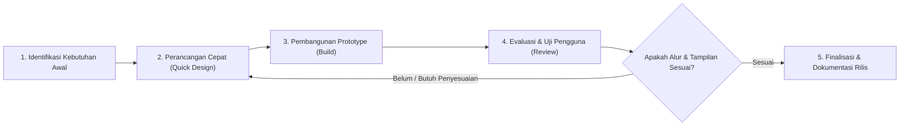

# DOKUMEN PERANCANGAN SISTEM SIMASADI
## Bagian 2: Tahap Perencanaan (Planning)

---

### 2.1 Metodologi Pengembangan Perangkat Lunak
Pengembangan sistem SIMASADI mengadopsi metodologi **Iterative Prototyping** dengan pendekatan kerja lincah (**Agile SDLC**). Pendekatan ini dipilih karena karakteristik proyek prototype yang berfokus pada validasi cepat alur kerja, iterasi desain antarmuka, dan umpan balik pengguna langsung.

#### Prinsip Kerja yang Diterapkan:
1. **Siklus Cepat & Berkelanjutan:** Setiap modul (LPK, Asesmen, Kalender, dll.) dibangun sebagai satu unit kerja kecil yang dapat langsung dioperasikan dan diuji.
2. **Umpan Balik Cepat (*Fast Feedback Loop*):** Penyesuaian antarmuka (seperti pemindahan posisi toggle di mobile, mode grid card, dan tombol detail) dapat langsung dievaluasi dalam hitungan iterasi singkat.
3. **Anti-Slop Quality Gate:** Setiap tampilan yang dibangun wajib melewati filter kualitas visual (bebas layout generik, responsif di semua ukuran layar, kontras teks memadai, navigasi keyboard berfungsi).

---

### 2.2 Rencana Jadwal & Garis Waktu Pengembangan (Timeline)

Proses pengembangan prototype SIMASADI dibagi ke dalam 6 fase utama:

| Fase | Durasi | Target Capaian (Deliverables) | Status |
|---|---|---|---|
| **Fase 1: Inisiasi & Analisis Kebutuhan** | Minggu 1 | Pengumpulan masalah operasional KAN, perumusan batasan prototype, spesifikasi kebutuhan fungsional & non-fungsional. | Selesai |
| **Fase 2: Perancangan Arsitektur & Database** | Minggu 2 | Desain ERD SQLite, perancangan skema relasi tabel, penentuan struktur MVC Laravel 13, dan pembuatan baseline seeder data. | Selesai |
| **Fase 3: Implementasi Modul Inti** | Minggu 3 | Pembuatan Controller, Model, dan Form untuk: Otentikasi, Profil LPK, Proses Akreditasi, dan Program Asesmen. | Selesai |
| **Fase 4: Implementasi Modul Pendukung & Pelacak** | Minggu 4 | Pembangunan Kalender Kegiatan interaktif (klik tanggal otomatis isi form), Pelaporan Masalah & Follow-up, Amandemen, serta Monitoring Layanan KANMIS & Riwayat Backup. | Selesai |
| **Fase 5: Modernisasi Antarmuka & UX Mobile** | Minggu 5 | Penerapan dual-mode (Tabel vs Grid Card), Mobile Slide-out Filter Drawer, Custom Searchable Select, Active Filter Chips, dan integrasi SweetAlert2. | Selesai |
| **Fase 6: Pengujian, Optimasi, & Dokumentasi** | Minggu 6 | Pelaksanaan pengujian otomatis (PHPUnit feature tests), audit responsivitas mobile, penyusunan dokumentasi teknis SDLC dan panduan README. | Selesai |

---

### 2.3 Analisis Kelayakan Sistem (*Feasibility Study*)

#### 2.3.1 Kelayakan Teknis (*Technical Feasibility*)
* **Kesiapan Infrastruktur:** Menggunakan PHP 8.3 dan Laravel 13 yang stabil dengan fitur typing modern, Eloquent ORM, dan Blade components.
* **Basis Data Ringan:** Database SQLite berjalan secara serverless (berbasis file `database.sqlite`), menjamin kemudahan pemindahan (*portability*) tanpa membutuhkan konfigurasi RDBMS terpisah (seperti MySQL/PostgreSQL) selama masa validasi prototype.
* **Frontend Nir-Ketergantungan Berat:** Menggunakan Vanilla CSS dengan design tokens dan Vanilla JS modular, menghindari overhead framework JavaScript raksasa dan menjamin kecepatan render instan pada browser modern.

#### 2.3.2 Kelayakan Operasional (*Operational Feasibility*)
* **Kemudahan Penggunaan (*Usability*):** Antarmuka dirancang mengikuti kaidah desain korporat BSN yang bersih, kontras tinggi, dan ramah pengguna non-teknis.
* **Akses Lintas Perangkat (*Multi-device Support*):** Sistem dapat diakses mulus baik melalui komputer desktop kantor maupun smartphone/tablet asesor saat bertugas di lokasi LPK.
* **Peralihan Tampilan Fleksibel:** Pengguna dapat memilih tampilan tabel padat (*dense data table*) saat menganalisis banyak entri, atau tampilan kartu (*grid cards*) yang lebih visual di layar sentuh.

#### 2.3.3 Kelayakan Hukum & Kebijakan (*Legal & Compliance*)
* **Kepatuhan Data:** Seluruh data yang di-seed pada prototype merupakan data simulasi fiktif (*dummy data*) yang tidak melanggar kerahasiaan sertifikasi LPK nyata sesuai prinsip integritas BSN/KAN.

---

### 2.4 Manajemen Risiko & Rencana Mitigasi

| Risiko Potensial | Dampak | Probabilitas | Rencana Mitigasi |
|---|---|---|---|
| **Fragmentasi Layout pada Layar Kecil (Mobile)** | Tinggi | Sedang | Menerapkan media query presisi (breakpoint 600px), mengubah filter menjadi drawer slide-out dari kanan, dan menyusun tombol filter sejajar toggle grid/table. |
| **Kehilangan Status Filter saat Berpindah Halaman (Pagination)** | Sedang | Tinggi | Menjaga seluruh query string URL pada pagination link menggunakan `$data->withQueryString()->links()` dan sinkronisasi server-side form. |
| **Ketergantungan Data Eksternal (KANMIS API)** | Sedang | Rendah | Menggunakan arsitektur representasional internal (model `Service` dan `Backup`) sehingga sistem tetap dapat didemonstrasikan secara mandiri tanpa bergantung pada endpoint eksternal aktif. |
| **Kueri Lambat pada Tabel dengan Banyak Data** | Sedang | Rendah | Menggunakan pagination standar Laravel (default 10 baris per halaman dengan opsi dinamis 25, 50, 100 entries) dan pengindeksan foreign key pada SQLite. |
