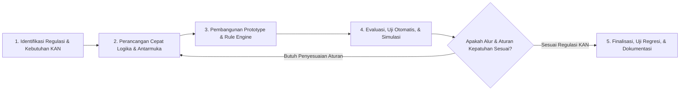

# DOKUMEN PERANCANGAN SISTEM SIMASADI
## Bagian 2: Tahap Perencanaan (Planning)

---

### 2.1 Metodologi Pengembangan Perangkat Lunak
Pengembangan sistem SIMASADI mengadopsi metodologi **Iterative Prototyping** dengan pendekatan kerja lincah (**Agile SDLC**). Pendekatan ini dipilih karena karakteristik domain akreditasi KAN yang sarat dengan aturan regulasi spesifik (seperti pedoman KAN U-01, Standar Biaya Masukan PMK, dan batasan SLA tindakan perbaikan), sehingga membutuhkan validasi berkelanjutan dan penyempurnaan alur secara cepat.

#### Prinsip Kerja yang Diterapkan:
1. **Iterasi Berbasis Regulasi:** Setiap aturan bisnis baru (misalnya siklus toleransi pengisian surveilen 3 tahap, SLA tindakan perbaikan, dan skema import massal) diimplementasikan dan diverifikasi langsung melalui unit & feature test sebelum melangkah ke modul berikutnya.
2. **Umpan Balik Cepat (*Fast Feedback Loop*):** Penyesuaian antarmuka (seperti pemisahan badge warna pembekuan menjadi ungu, penghapusan awalan teks redundan pada keterangan operasional, dan peletakan kontrol filter mobile) diuji secara interaktif pada desktop dan layar sentuh.
3. **Standar Kualitas Visual Bebas Slop (*Anti-Slop Quality Gate*):** Setiap komponen visual wajib memenuhi rasio kontras warna tinggi (WCAG AA), struktur data yang bersih tanpa dekorasi artifisial, tipografi Instrument Sans yang jelas, serta navigasi tabel interaktif yang intuitif.

---

### 2.2 Rencana Jadwal & Garis Waktu Pengembangan (Timeline)

Proses pengembangan sistem SIMASADI dilaksanakan dalam 6 fase terstruktur:

| Fase | Durasi | Target Capaian (*Deliverables*) | Status |
|---|---|---|---|
| **Fase 1: Inisiasi & Analisis Kebutuhan KAN** | Minggu 1 | Pengumpulan regulasi akreditasi KAN (KAN U-01), perumusan kebutuhan fungsional 8 tipe asesmen, serta penetapan batasan prototype operasional. | Selesai |
| **Fase 2: Perancangan Arsitektur Basis Data** | Minggu 2 | Perancangan skema relasional terpadu (LPK, Asesmen, Biaya SBM, Billing, Akreditasi, dan Kalender Event), pembersihan tabel usang, serta penyiapan baseline seeder data. | Selesai |
| **Fase 3: Implementasi Modul Inti & 8 Tipe Asesmen** | Minggu 3 | Implementasi Model Eloquent dan Controller untuk pengelolaan master LPK, penjadwalan 8 tipe asesmen KAN, kalender kegiatan interaktif 5 tipe event, dan navigasi multi-peran. | Selesai |
| **Fase 4: Penegakan Toleransi Surveilen & SLA Tindakan Perbaikan** | Minggu 4 | Pembangunan mesin status dinamis: toleransi akhir bulan kunjungan, pembekuan otomatis (SUSPENDED) dengan jendela 1 tahun, pencabutan otomatis (REVOKED), auto-realisasi data lampau LPK aktif, serta aturan ketat perpanjangan SLA TP maksimal 1 bulan bersurat resmi. | Selesai |
| **Fase 5: Kepatuhan Finansial, e-Sign, & Alur EHA** | Minggu 5 | Integrasi pelaporan biaya perjalanan dinas berbasis SBM PMK, penerbitan billing SIMPONI 15 digit ber-NTPN sah, Quality Gate kesiapan rilis SK, simulasi e-Sign BSrE dengan hash SHA-256, alur EHA, dan portal publik ber-QR Code. | Selesai |
| **Fase 6: Impor Massal, Live Feed Google Sheets, & Uji Komprehensif** | Minggu 6 | Implementasi smart importer (CSV/XLSX/Google Sheets) untuk LPK dan Asesmen, penyediaan live feed CSV terotentikasi, pelaksanaan automated feature test suite (119 pengujian, 680 assertions, 100% pass rate), serta finalisasi dokumentasi SDLC. | Selesai |

---

### 2.3 Analisis Kelayakan Sistem (*Feasibility Study*)

#### 2.3.1 Kelayakan Teknis (*Technical Feasibility*)
* **Kesiapan Backend:** Menggunakan PHP 8.2+ / PHP 8.3+ dan Laravel 12/13 yang menyediakan arsitektur MVC matang, query builder tangguh, Eloquent ORM dengan eager loading, serta test runner terintegrasi.
* **Basis Data Ringan & Portabel:** Menggunakan SQLite 3 single-file (`database/database.sqlite`), menjamin kemudahan deployment di server pengembang lokal, docker container, maupun lingkungan intranet instansi tanpa konfigurasi RDBMS terpisah.
* **Frontend Efisien & Nir-Overhead:** Menggunakan Vanilla CSS modern dengan Design Tokens dan Vanilla JS modular yang dikompilasi oleh Vite, menghasilkan bundle aset yang sangat ringan (< 150 kB) dan waktu muat instan tanpa ketergantungan framework JavaScript klien yang masif.

#### 2.3.2 Kelayakan Operasional (*Operational Feasibility*)
* **Pemisahan Peran Tegas (RBAC 4 Peran):** Hak akses dikelompokkan secara proporsional sesuai tugas operasional nyata di instansi: Admin Unit Lab, PIC Unit Teknis, Asesor KAN, dan LPK pemegang akreditasi.
* **Otomasi Status Tanpa Beban Input Manual:** Status tindakan perbaikan (TP) dan status pengawasan LPK dihitung secara otomatis oleh sistem, mencegah inkonsistensi data akibat kelalaian pembaruan manual oleh operator.
* **Dukungan Lintas Perangkat:** Antarmuka responsif penuh dari layar monitor desktop kerja kantor, tablet verifikator, hingga smartphone staf di lapangan.

#### 2.3.3 Kelayakan Hukum & Kebijakan (*Legal & Compliance*)
* **Kepatuhan Pedoman KAN U-01:** Seluruh batas waktu, jenis kegiatan surveilen, toleransi pengisian dokumen, dan sanksi pembekuan hingga pencabutan disusun mengacu langsung pada pedoman resmi Komite Akreditasi Nasional.
* **Kepatuhan SBM PMK & PNBP Kemenkeu:** Format pelaporan biaya perjalanan dinas dan billing SIMPONI mematuhi regulasi perbendaharaan negara Republik Indonesia.

---

### 2.4 Manajemen Risiko & Rencana Mitigasi

| Risiko Potensial | Tingkat Dampak | Probabilitas | Rencana Mitigasi |
|---|---|---|---|
| **Loop Rekursif pada Accessor Status Model** | Tinggi | Rendah | Menggunakan pembacaan langsung dari `$this->attributes['status']` pada getter pembantu (`getIsSuspensionExpiredAttribute`, `getIsSubmissionOverdueAttribute`) sebelum memanggil properti dinamis. |
| **Status Masa Lalu LPK Aktif Menggantung sebagai Dibekukan** | Tinggi | Sedang | Menerapkan aturan auto-realisasi data historis: jika LPK berstatus aktif saat ini, seluruh asesmen surveilen dan TP tahun-tahun sebelumnya (`end_at < now()->startOfYear()`) otomatis berstatus selesai (`COMPLETED` dan `SATISFIED`). |
| **Penyalahgunaan Fasilitas Perpanjangan Waktu Tindakan Perbaikan** | Sedang | Rendah | Mengunci opsi perpanjangan waktu pada sistem: perpanjangan hanya diizinkan maksimal 1 bulan jika ada tindak lanjut nyata terhadap temuan ketidaksesuaian dan menyertakan nomor surat permohonan resmi. |
| **Kehilangan Status Filter saat Navigasi Halaman** | Sedang | Rendah | Menjaga seluruh query string filter aktif menggunakan `$data->withQueryString()->links()` pada seluruh kontrol pagination Blade. |
| **Kegagalan Pemrosesan Impor Data Berbeda Format** | Sedang | Rendah | Menerapkan deteksi cerdas pemisah delimiter (koma dan titik koma) serta normalisasi format tanggal fleksibel pada `LpkImportController` dan `AssessmentImportController`. |
