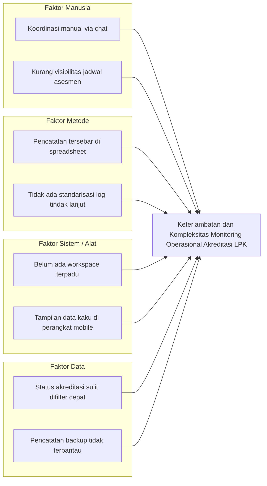

# DOKUMEN PERANCANGAN SISTEM SIMASADI
## Bagian 3: Tahap Analisis (Analysis)

---

### 3.1 Analisis Masalah

Untuk memahami kendala operasional pengelolaan akreditasi LPK secara mendalam, digunakan metode analisis **PIECES Framework** (*Performance, Information, Economics, Control, Efficiency, Service*) dan diagram sebab-akibat (**Fishbone / Ishikawa Diagram**).

#### 3.1.1 Analisis PIECES

| Dimensi | Kondisi Saat Ini (Sebelum SIMASADI) | Kondisi yang Diharapkan (Dengan SIMASADI) |
|---|---|---|
| **Performance (Kinerja)** | Informasi progres akreditasi dan jadwal surveilen memakan waktu lama untuk dikompilasi dari berbagai lembar kerja Excel manual. | Dashboard eksekutif menyajikan KPI instan (LPK aktif, asesmen terjadwal, isu terbuka) dengan respons waktu milidetik. |
| **Information (Informasi)** | Data LPK dan riwayat akreditasi rawan inkonsisten atau duplikasi; sulit melacak agenda kerja asesmen yang mendekati batas waktu. | Data tersentralisasi dalam skema relasional, dilengkapi filter multi-kriteria dan tampilan kalender bulanan interaktif. |
| **Economics (Biaya & Sumber Daya)** | Banyak waktu staf terbuang untuk saling bertukar email dan pesan singkat hanya untuk memastikan status suatu permohonan akreditasi. | Efisiensi waktu kerja staf meningkat berkat akses informasi satu pintu yang transparan dan selalu terbarui. |
| **Control & Security (Kontrol & Keamanan)** | Tidak ada pembatasan hak akses berbasis sesi; riwayat follow-up kendala operasional tidak terdokumentasi terpusat. | Autentikasi sesi terproteksi; setiap penanganan kendala tercatat dengan aktor pencatat dan cap waktu (*timestamp*). |
| **Efficiency (Efisiensi)** | Pembuatan agenda kerja dan pengingat tanggal surveilen dilakukan terpisah dari basis data master LPK. | Fitur pembuatan agenda otomatis langsung dari kotak tanggal kalender yang terhubung langsung ke ID LPK. |
| **Service (Layanan)** | Lambatnya koordinasi dapat menyebabkan keterlambatan respon terhadap pengajuan amandemen atau isu sertifikasi LPK. | Visibilitas status yang jelas (*Submitted, In Review, Approved, Rejected*) mempercepat siklus tindak lanjut layanan KAN. |

#### 3.1.2 Fishbone Diagram (Analisis Sebab-Akibat Masalah)

---

### 3.2 Analisis Kebutuhan Fungsional (*Functional Requirements*)

Kebutuhan fungsional mendefinisikan kapabilitas dan fitur yang wajib disediakan oleh sistem SIMASADI. Setiap kebutuhan diberi kode identifikasi unik (`REQ-F-XX`) untuk memastikan keterlacakan (*traceability*).

| Kode Kebutuhan | Kategori Modul | Deskripsi Kebutuhan Fungsional | Aktor Terkait |
|---|---|---|---|
| **REQ-F-01** | Autentikasi | Sistem harus menyediakan halaman login dan memvalidasi kredensial email/password pengguna internal. | Semua Pengguna |
| **REQ-F-02** | Autentikasi | Sistem harus membatasi akses halaman operasional hanya untuk pengguna yang telah terotentikasi (*auth guard*). | Pengguna Tamu (*Guest*) |
| **REQ-F-03** | Autentikasi | Sistem harus menyediakan fitur logout yang menghapus sesi pengguna dengan aman. | Pengguna Terotentikasi |
| **REQ-F-04** | Dashboard | Sistem harus menampilkan ringkasan metrik utama: total LPK terdaftar, proses akreditasi aktif, asesmen terjadwal, dan masalah operasional terbuka. | Semua Pengguna |
| **REQ-F-05** | Dashboard | Sistem harus menyajikan visualisasi analisis status akreditasi dalam bentuk progress bar persentase (Belum Mulai, Berjalan, Selesai). | Semua Pengguna |
| **REQ-F-06** | Dashboard | Sistem harus menampilkan daftar masalah berprioritas tinggi dan aktivitas akreditasi/asesmen terbaru pada dashboard. | Semua Pengguna |
| **REQ-F-07** | Data LPK | Sistem harus mampu menampilkan daftar LPK dengan pagination dan fitur pencarian nama, kode registrasi, serta filter status/kategori. | Staf / Admin |
| **REQ-F-08** | Data LPK | Sistem harus menyediakan formulir penambahan LPK baru dan pengubahan data profil LPK yang sudah ada. | Staf / Admin |
| **REQ-F-09** | Data LPK | Sistem harus menampilkan halaman detail profil LPK yang memuat riwayat proses akreditasi dan daftar program asesmen terkait. | Semua Pengguna |
| **REQ-F-10** | Akreditasi | Sistem harus menampilkan daftar proses akreditasi dengan filter status (*Not Started, In Progress, Completed*), LPK, serta rentang tanggal. | Semua Pengguna |
| **REQ-F-11** | Akreditasi | Sistem harus menyajikan halaman detail akreditasi yang menampilkan nomor registrasi, tahapan monitoring, dan target jatuh tempo. | Semua Pengguna |
| **REQ-F-12** | Program Asesmen | Sistem harus mengelola agenda asesmen (Surveilen, Asesmen Awal, Reassessment) beserta status pelaksanaan (*Planned, Scheduled, In Progress, Completed, Cancelled*). | Auditor / Staf |
| **REQ-F-13** | Program Asesmen | Sistem harus memvalidasi agar waktu selesai asesmen tidak lebih awal daripada waktu mulai. | Auditor / Staf |
| **REQ-F-14** | Kalender Kegiatan | Sistem harus menampilkan kalender kerja bulanan interaktif dengan grid 7 hari, penanda hari ini (*today*), dan daftar event harian. | Semua Pengguna |
| **REQ-F-15** | Kalender Kegiatan | Pengguna dapat mengklik langsung kotak tanggal tertentu pada kalender untuk membuka form tambah agenda dengan tanggal mulai/selesai otomatis terisi. | Semua Pengguna |
| **REQ-F-16** | Kalender Kegiatan | Sistem harus menyediakan mode tampilan alternatif (Mode Kalender Kotak vs Mode Agenda Mobile) yang persisten di `localStorage`. | Semua Pengguna |
| **REQ-F-17** | Amandemen | Sistem harus mencatat permohonan amandemen ruang lingkup akreditasi beserta nomor pengajuan, tanggal permohonan, dan status verifikasi. | Staf / Admin |
| **REQ-F-18** | Pelaporan Masalah | Sistem harus menyediakan fitur pelaporan masalah operasional dengan penetapan tingkat prioritas (*Low, Medium, High*) dan status penanganan. | Semua Pengguna |
| **REQ-F-19** | Pelaporan Masalah | Sistem harus menyediakan form penambahan catatan tindak lanjut (*follow-up*) berantai pada halaman detail masalah. | Semua Pengguna |
| **REQ-F-20** | Monitoring KANMIS | Sistem harus menampilkan status kesehatan layanan sistem KANMIS (Up, Degraded, Down) beserta waktu pengecekan terakhir. | Admin |
| **REQ-F-21** | Histori Backup | Sistem harus menampilkan catatan riwayat pencadangan data manual (status Berhasil/Gagal, ukuran file, waktu selesai, dan staf pencatat). | Admin |
| **REQ-F-22** | Antarmuka Pengguna | Sistem harus menyediakan kontrol *toggle* tampilan data instan: mode **Tabel** dan mode **Grid Cards** di seluruh halaman berdata master. | Semua Pengguna |
| **REQ-F-23** | Antarmuka Pengguna | Pada layar mobile (lebar <= 600px), sistem harus menyusun tombol filter dan toggle view secara berdampingan (sejajar) serta menampilkan filter dalam bentuk drawer geser. | Pengguna Mobile |
| **REQ-F-24** | Antarmuka Pengguna | Sistem harus menampilkan *active filter chips* di bawah toolbar saat ada filter aktif dan menyediakan tautan *Reset Filter*. | Semua Pengguna |
| **REQ-F-25** | Biaya Asesor (SBM) | Sistem harus mengelola pelaporan biaya perjalanan dinas asesor (uang harian, transportasi, akomodasi, paket data) dan status verifikasi kepatuhan SBM Kementerian Keuangan (*Belum Dilaporkan, Menunggu Verifikasi, Terverifikasi SBM, Perlu Revisi*). | Asesor / Staf KAN |
| **REQ-F-26** | Billing PNBP | Sistem harus mencatat kode billing SIMPONI 15 digit, tarif nominal PNBP jasa akreditasi, masa berlaku pembayaran, dan status realisasi pelunasan dengan nomor NTPN kas negara yang sah. | Bendahara / Staf KAN |
| **REQ-F-27** | e-Sign BSrE | Sistem harus mengelola status sertifikasi tanda tangan digital resmi BSrE (BSSN) untuk SK Akreditasi, mencatat nama penandatangan, NIP, seri sertifikat, serta nilai hash SHA-256 untuk verifikasi publik via QR Code. | Pejabat KAN / Publik |
| **REQ-F-28** | Quality Gate Terbit SK | Sistem harus memvalidasi kesiapan rilis dokumen akreditasi (*Accreditation Release Readiness Gate*) di mana SK hanya dapat ditandatangani dan dirilis ke LPK bila realisasi billing PNBP telah terbayar (`PAID`) dan seluruh biaya asesmen telah berstatus `TERVERIFIKASI`. | Semua Pengguna |

---

### 3.3 Analisis Kebutuhan Non-Fungsional (*Non-Functional Requirements*)

Kebutuhan non-fungsional mendefinisikan batasan kualitas teknis, keamanan, performa, dan pengalaman pengguna (*quality attributes*).

| Kode Kebutuhan | Aspek Kualitas | Spesifikasi Kebutuhan Non-Fungsional |
|---|---|---|
| **REQ-NF-01** | **Performa (Performance)** | Waktu render halaman utama dan pemrosesan filter *server-side* tidak boleh melebihi 1 detik pada koneksi lokal standar. |
| **REQ-NF-02** | **Keamanan (Security)** | Seluruh formulir POST/PUT wajib dilindungi token Cross-Site Request Forgery (CSRF). Password pengguna dienkripsi dengan algoritma bcrypt/Argon2. |
| **REQ-NF-03** | **Keamanan (Security)** | Query database wajib menggunakan Laravel Eloquent ORM / Parameter Binding untuk mencegah kerentanan SQL Injection. |
| **REQ-NF-04** | **Usabilitas (Usability)** | Antarmuka wajib menerapkan panduan *Anti-Slop Visual*: hierarki tipografi menggunakan font *Instrument Sans*, palet warna terkurasi (Ink `#1a1a1a`, Purple `#5645d4`, Lavender `#f0edff`), dan bebas elemen dekoratif artifisial. |
| **REQ-NF-05** | **Aksesibilitas (Accessibility)** | Rasio kontras teks terhadap latar belakang minimal 4.5:1 (kategori AA WCAG 2.1). Tombol dan form input memiliki indikator focus keyboard (*outline/box-shadow*) yang jelas. |
| **REQ-NF-06** | **Responsivitas (Responsiveness)** | Tampilan aplikasi harus beradaptasi mulus dari layar desktop resolusi tinggi (>= 1200px), tablet (768px - 1024px), hingga smartphone kecil (360px - 600px). |
| **REQ-NF-07** | **Keandalan (Reliability)** | Penanganan error form harus menampilkan pesan validasi spesifik di bawah input terkait serta pop-up peringatan terpusat menggunakan SweetAlert2. |
| **REQ-NF-08** | **Portabilitas (Portability)** | Basis data menggunakan SQLite single-file (`database/database.sqlite`) sehingga proyek dapat dijalankan di lingkungan pengembang mana pun tanpa ketergantungan software database server eksternal. |
| **REQ-NF-09** | **Maintainability (Kemudahan Perawatan)** | Struktur kode mematuhi standar PSR-12, arsitektur MVC Laravel terpisah rapi, dan seluruh alur kerja utama dicakup oleh automated feature tests (PHPUnit). |
