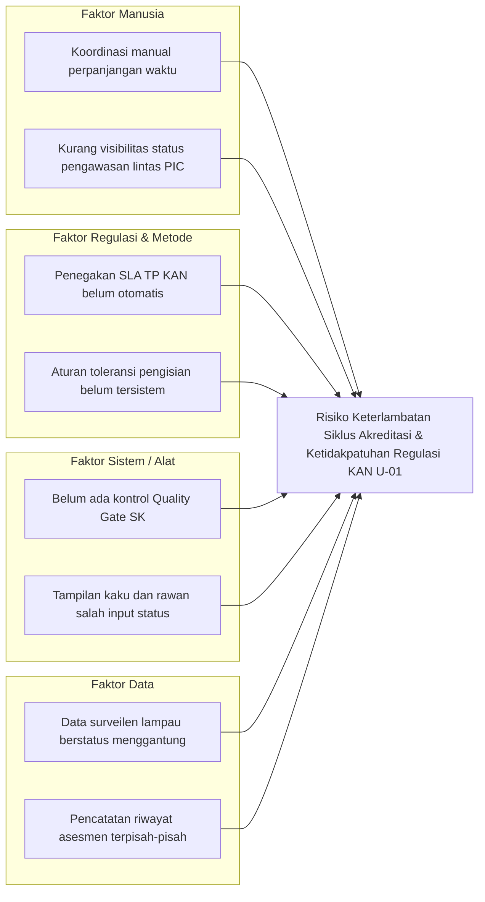

# DOKUMEN PERANCANGAN SISTEM SIMASADI
## Bagian 3: Tahap Analisis (Analysis)

---

### 3.1 Analisis Masalah

Analisis masalah operasional pengelolaan akreditasi LPK dilakukan menggunakan metode **PIECES Framework** (*Performance, Information, Economics, Control, Efficiency, Service*) dan diagram sebab-akibat (**Fishbone / Ishikawa Diagram**).

#### 3.1.1 Analisis PIECES

| Dimensi | Kondisi Sebelum SIMASADI | Kondisi yang Diwujudkan SIMASADI |
|---|---|---|
| **Performance (Kinerja)** | Informasi progres akreditasi, status surveilen, dan batas SLA tindakan perbaikan memerlukan waktu lama untuk direkap manual dari berbagai file terpisah. | Dashboard eksekutif menyajikan KPI instan, indikator pengawasan aktif, dan notifikasi persisten prioritas tinggi dengan waktu muat di bawah 200 ms. |
| **Information (Informasi)** | Status akreditasi sering kali statis dan tidak mencerminkan keterlambatan surveilen atau pelanggaran batas waktu tindakan perbaikan secara real-time. | Mesin status dinamis menghitung kepatuhan secara otomatis: toleransi pengisian dokumen (maksimal 4 bulan dari bulan ke-15 siklus akreditasi atau tanggal kunjungan), pembekuan bertahap dengan countdown 1 tahun, hingga pencabutan akreditasi. |
| **Economics (Biaya & Waktu)** | Waktu staf habis untuk koordinasi manual, pengecekan surat permohonan perpanjangan waktu, serta pemantauan siklus surveilen secara parsial. | Efisiensi administrasi meningkat melalui validasi sistem otomatis terhadap syarat perpanjangan SLA, peringatan dini batas pengisian, dan otomasi alur EHA. |
| **Control & Security (Kontrol & Keamanan)** | Pembatasan hak akses belum terstandarisasi, risiko kelalaian verifikasi, dan kerentanan modifikasi data LPK lintas unit. | Role-Based Access Control 2 peran (*Ketua Tim dan PIC Laboratorium*), pembatasan tunggal 1 akun Ketua Tim, serta Quality Gate pelepasan SK yang terkunci sebelum syarat terpenuhi. |
| **Efficiency (Efisiensi)** | Penjadwalan asesmen, pemantauan pengingat SK, dan pelaporan spreadsheet dilakukan secara manual dan terfragmentasi. | Kalender interaktif 5 tipe event terintegrasi, impor massal (CSV/XLSX), serta live feed CSV otomatis untuk Google Sheets (`=IMPORTDATA`). |
| **Service (Layanan)** | Pengguna internal kesulitan memantau kemajuan tindak lanjut asesmen dan status akreditasi secara transparan. | Antarmuka pemantauan status dinamis dan kalender interaktif menyajikan kepatuhan akreditasi secara real-time bagi Ketua Tim dan PIC. |

#### 3.1.2 Fishbone Diagram (Analisis Sebab-Akibat Masalah)

```mermaid
graph LR
    subgraph Manusia ["Faktor Manusia"]
        M1["Koordinasi manual perpanjangan waktu"]
        M2["Kurang visibilitas status pengawasan lintas PIC"]
    end
    subgraph Metode ["Faktor Regulasi & Metode"]
        T1["Penegakan SLA TP KAN belum otomatis"]
        T2["Aturan toleransi pengisian belum tersistem"]
    end
    subgraph Sistem ["Faktor Sistem / Alat"]
        S1["Belum ada kontrol Quality Gate SK"]
        S2["Tampilan kaku dan rawan salah input status"]
    end
    subgraph Data ["Faktor Data"]
        D1["Data surveilen lampau berstatus menggantung"]
        D2["Pencatatan riwayat asesmen terpisah-pisah"]
    end

    M1 & M2 --> MasalahUtama["Risiko Keterlambatan Siklus Akreditasi & Ketidakpatuhan Regulasi KAN U-01"]
    T1 & T2 --> MasalahUtama
    S1 & S2 --> MasalahUtama
    D1 & D2 --> MasalahUtama
```

---

### 3.2 Analisis Kebutuhan Fungsional (*Functional Requirements*)

Setiap kebutuhan fungsional diberi kode unik (`REQ-F-XX`) untuk menjamin keterlacakan (*traceability*):

| Kode Kebutuhan | Kategori Modul | Deskripsi Kebutuhan Fungsional | Aktor Terkait |
|---|---|---|---|
| **REQ-F-01** | Autentikasi & RBAC | Sistem harus menyediakan halaman login dan memvalidasi kredensial pengguna internal berdasarkan 2 peran nyata: Ketua Tim (`admin`) dan PIC Laboratorium (`pic`), dengan pembatasan tunggal 1 akun Ketua Tim. | Semua Pengguna |
| **REQ-F-02** | Autentikasi & RBAC | Sistem harus membatasi akses antarmuka dan endpoint mutasi data sesuai batasan peran (*role middleware*). | Tamu & Pengguna Terdaftar |
| **REQ-F-03** | Profil Pengguna | Sistem harus menyediakan halaman profil pengguna untuk mengubah nama, email, dan kata sandi dengan verifikasi kata sandi lama. | Semua Pengguna |
| **REQ-F-04** | Dashboard Eksekutif | Sistem harus menyajikan ringkasan KPI utama: total LPK, akreditasi aktif, pengawasan jatuh tempo, dan tindakan perbaikan mendesak. | Semua Pengguna |
| **REQ-F-05** | Dashboard Eksekutif | Sistem harus menampilkan Persistent Alert Banner prioritas tinggi di urutan teratas yang tidak dapat ditutup sampai jadwal ditindaklanjuti. | Ketua Tim & PIC |
| **REQ-F-06** | Dashboard Eksekutif | Sistem harus menampilkan widget tabel cepat LPK jatuh tempo dan asesmen yang membutuhkan tindakan segera. | Ketua Tim & PIC |
| **REQ-F-07** | Data Master LPK | Sistem harus mengelola nomor registrasi resmi KAN (`no_reg`), nama LPK, skema akreditasi KAN (`kan_schema`), alamat, email, telepon, dan penugasan PIC. | Ketua Tim |
| **REQ-F-08** | Data Master LPK | Sistem harus mengotomasi tanggal kedaluwarsa sertifikat (+5 tahun dari tanggal terbit jika dikosongkan) dan tautan berkas Google Drive terpadu. | Ketua Tim |
| **REQ-F-09** | Status Akreditasi Dinamis | Sistem harus menghitung status LPK secara dinamis di memori: `ACTIVE`, `SURVEILLANCE_DUE`, `SURVEILLANCE_OVERDUE`, `SUSPENDED`, `REVOKED`, `EXPIRED`, `INACTIVE`. | Semua Pengguna |
| **REQ-F-10** | Keterangan Operasional | Sistem harus memformat keterangan operasional otomatis (`dynamic_keterangan`) langsung pada isi kegiatan utama dalam teks tebal tanpa imbuhan teks awalan yang redundan. | Semua Pengguna |
| **REQ-F-11** | 8 Tipe Asesmen & Siklus KAN | Sistem harus mendukung pengelolaan 8 tipe proses asesmen resmi KAN dengan klasifikasi: siklus periodik 5 tahunan (S1, S2, RA berbasis tanggal sertifikat dan expired_at) dan non-periodik/ad-hoc (AA, PRL, STT berbasis permohonan/insidental dengan batas TP terikat tanggal realisasi). | Ketua Tim & PIC |
| **REQ-F-12** | Validasi Tanggal Asesmen | Sistem harus memvalidasi agar tanggal/jam selesai asesmen tidak boleh lebih lampau daripada tanggal/jam mulai. | Ketua Tim & PIC |
| **REQ-F-13** | Toleransi Pengisian Surveilen | Sistem harus menetapkan batas toleransi pengisian dokumen asesmen surveilen maksimal 4 bulan dari bulan ke-15 siklus akreditasi atau tanggal kunjungan, tersimpan pada kolom `submission_due_date` yang fleksibel dapat diedit. | Semua Pengguna |
| **REQ-F-14** | Pembekuan & Pencabutan Bertahap | Sistem harus mengubah status asesmen dan LPK menjadi DIBEKUKAN (`SUSPENDED`, badge ungu) jika melewati toleransi, memberikan kesempatan penyelesaian 1 tahun, dan mencabut akreditasi (`REVOKED`) bila 1 tahun terlewati tanpa penyelesaian. | Semua Pengguna |
| **REQ-F-15** | Auto-Realisasi LPK Aktif | Sistem harus menganggap seluruh asesmen surveilen dan TP tahun-tahun sebelumnya (`end_at < now()->startOfYear()`) dari LPK aktif otomatis terealisasi (`COMPLETED` dan `SATISFIED`). | Semua Pengguna |
| **REQ-F-16** | Batas Waktu Dasar Tindakan Perbaikan | Sistem harus menghitung batas waktu tindakan perbaikan berbasis tanggal selesai realisasi asesmen (`end_at`): 3 bulan kalender untuk Akreditasi Awal (AA), dan 2 bulan kalender untuk tipe asesmen lainnya. | Semua Pengguna |
| **REQ-F-17** | Kontrol Perpanjangan Waktu TP | Sistem harus membatasi perpanjangan maksimal 1 bulan kalender (`effective_tp_due_date = tp_due_date + 1 bln`), otomatis memperpanjang dan menampilkan badge `(+1 Bulan Surat Resmi)` saat nomor surat resmi diinput, serta hanya berlaku jika ada progres perbaikan temuan. | Admin & PIC |
| **REQ-F-18** | Status Otomatis TP | Sistem harus menampilkan status tindakan perbaikan secara otomatis tanpa input manual: Sedang Berlangsung, Dibekukan (ungu) bila lewat batas waktu, dan Memenuhi bila telah diselesaikan. | Semua Pengguna |
| **REQ-F-19** | Pengingat Kalender & Dasbor PIC | Sistem harus menyajikan notifikasi pengingat otomatis (difilter per LPK binaan PIC): Pengingat 1 (2 bulan untuk AA, 1 bulan lainnya), Notifikasi Final tepat batas waktu, dan Pengingat SK 10 hari setelah TP diselesaikan. | Semua Pengguna |
| **REQ-F-20** | Alur EHA & Penerbitan SK | Sistem harus mencatat tanggal rencana sidang EHA, realisasi EHA, nomor SK resmi, tanggal terbit SK, dan menghitung otomatis lead time terbit SK (`sk_lead_time_days`). | Admin Unit Lab |
| **REQ-F-21** | Kalender Kerja Multi-Event | Sistem harus menampilkan kalender kerja bulanan interaktif dengan 5 tipe event berkode warna kontras: Asesmen, Pengingat Surveilen, Pengingat TP, Overdue TP, dan Pengingat SK. | Semua Pengguna |
| **REQ-F-22** | Navigasi Kalender Cepat | Sistem harus menyediakan dropdown pemilih langsung bulan dan tahun dengan jangkauan tahun dinamis hingga masa kedaluwarsa LPK terjauh. | Semua Pengguna |
| **REQ-F-23** | Pembuatan Agenda Instan | Pengguna dapat mengklik langsung kotak tanggal pada kalender untuk membuka form penambahan agenda dengan tanggal mulai dan tanggal selesai terisi otomatis. | Admin & PIC |
| **REQ-F-24** | Quality Gate Terbit SK | Sistem harus memvalidasi agar SK Akreditasi hanya dapat dirilis setelah sidang EHA direalisasikan dan pemenuhan tindakan perbaikan berstatus selesai. | Semua Pengguna |
| **REQ-F-25** | Impor Massal LPK | Sistem harus menyediakan fitur impor massal data master LPK dari file CSV, file spreadsheet XLSX, dan URL live Google Sheets dengan logika *Smart Upsert*. | Admin Unit Lab |
| **REQ-F-26** | Impor Massal Asesmen | Sistem harus menyediakan fitur impor massal jadwal asesmen lapangan dari file CSV dengan pemetaan otomatis nomor registrasi LPK dan tipe asesmen KAN. | Admin Unit Lab |
| **REQ-F-27** | Live Feeds Google Sheets | Sistem harus menyediakan endpoint live CSV terproteksi API key (`/feeds/lpks.csv`, `/feeds/assessments.csv`) untuk sinkronisasi formula `=IMPORTDATA`. | Admin & PIC |
| **REQ-F-28** | Antarmuka Dual-Mode & UX | Sistem harus menyediakan toggle tampilan Tabel vs Grid Cards, drawer filter mobile yang meluncur mulus, active filter chips, dan baris tabel yang dapat diklik (*Clickable Rows*). | Semua Pengguna |
| **REQ-F-29** | Kolaborasi Tim & Tautan Akun Multi-PIC | Sistem harus menyediakan fasilitas penautan akun antar-PIC di mana Lead PIC dapat menambahkan PIC lain sebagai *Viewer* (hanya-lihat) untuk memantau LPK binaannya tanpa hak modifikasi. | Admin & PIC |
| **REQ-F-30** | Sistem Tema Gelap & Terang Adaptif | Sistem harus mendukung perpindahan tema visual instan 1-klik antara Mode Terang dan Mode Gelap dengan deteksi preferensi sistem dan penyimpanan persisten di browser. | Semua Pengguna |
| **REQ-F-31** | Banner Pengawasan Persisten Wajib | Peringatan jatuh tempo pengawasan akreditasi harus tampil persisten dan tidak dapat disembunyikan sementara, guna menjamin kepatuhan tindak lanjut regulasi KAN. | Semua Pengguna |
| **REQ-F-32** | Tindakan Massal (Bulk Actions) | Pengguna dapat memilih banyak data sekaligus (multiselect checkbox) pada tabel LPK dan Asesmen untuk ekspor CSV massal maupun penghapusan massal terotorisasi. | Admin & PIC |

---

### 3.3 Analisis Kebutuhan Non-Fungsional (*Non-Functional Requirements*)

| Kode Kebutuhan | Aspek Kualitas | Spesifikasi Kebutuhan Non-Fungsional |
|---|---|---|
| **REQ-NF-01** | **Performa (Performance)** | Waktu muat halaman awal (*Time to First Byte*) di bawah 200 milidetik dan kueri relasional wajib menerapkan Eager Loading untuk mencegah N+1 Query. |
| **REQ-NF-02** | **Keamanan (Security)** | Seluruh transaksi formulir POST/PUT/DELETE wajib dilindungi token CSRF. Password pengguna dienkripsi dengan algoritma bcrypt. |
| **REQ-NF-03** | **Otorisasi (Authorization)** | Penerapan Role-Based Access Control (RBAC) ketat pada tingkat middleware rute, pengendali kontroler, dan tampilan tombol Blade. |
| **REQ-NF-04** | **Usabilitas (Anti-Slop Usability)** | Antarmuka mematuhi standar desain profesional bebas slop: tipografi Instrument Sans, badge status kontras tinggi, tidak menggunakan karakter dekoratif artifisial. |
| **REQ-NF-05** | **Aksesibilitas (Accessibility)** | Rasio kontras teks terhadap latar belakang memenuhi standar WCAG 2.1 AA (minimal 4.5:1) baik pada tema terang maupun gelap, tombol aksi memiliki focus indicator yang tegas untuk navigasi keyboard. |
| **REQ-NF-06** | **Responsivitas (Responsiveness)** | Tata letak beradaptasi mulus dari layar monitor desktop ultra-wide, laptop kerja, tablet verifikator (768px - 1024px), hingga smartphone (360px - 600px). |
| **REQ-NF-07** | **Keandalan Uji (Reliability)** | Seluruh logika aturan KAN, kalkulasi status, SLA perbaikan, dan pembatasan peran wajib lolos 100% pada automated test suite (183 tests, 1102 assertions). |
| **REQ-NF-08** | **Portabilitas (Portability)** | Basis data menggunakan SQLite 3 terpadu dan konfigurasi multi-platform (Docker Compose dan Composer/Node.js lokal). |
| **REQ-NF-09** | **Integritas Regulasi (Regulatory Compliance)** | Mengikuti ketentuan regulasi KAN U-01, standar ISO/IEC 17011, serta pedoman tata kelola akreditasi nasional. |
| **REQ-NF-10** | **Kemudahan Pemeliharaan (Maintainability)** | Struktur kode mematuhi standar PSR-12, arsitektur MVC terstruktur rapi, serta terdokumentasi lengkap dalam dokumen perancangan SDLC. |
