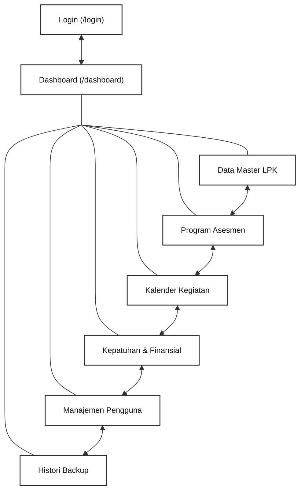
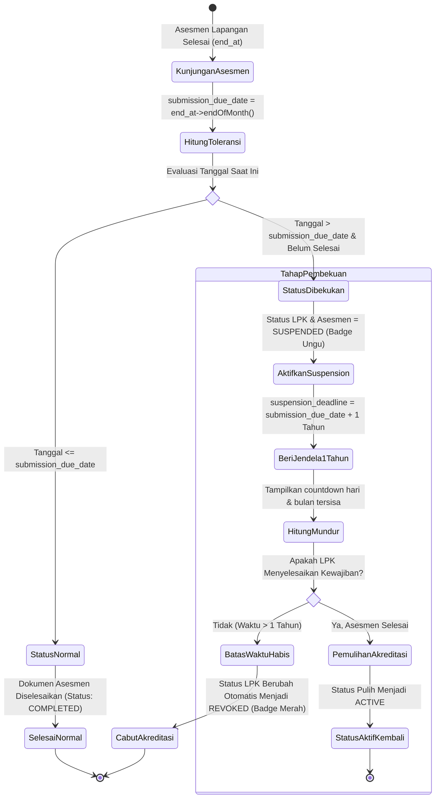
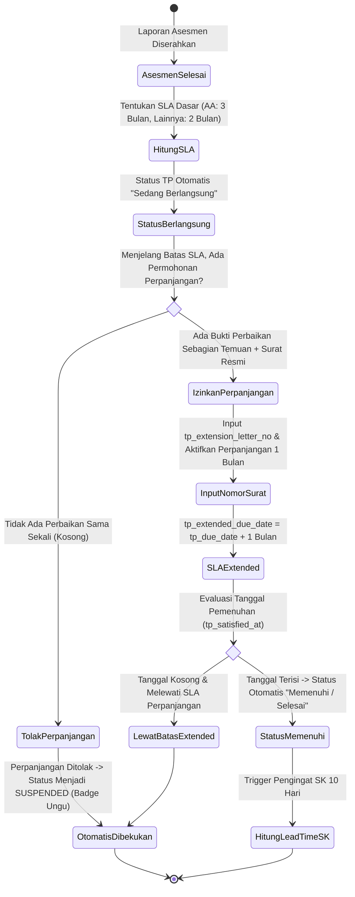
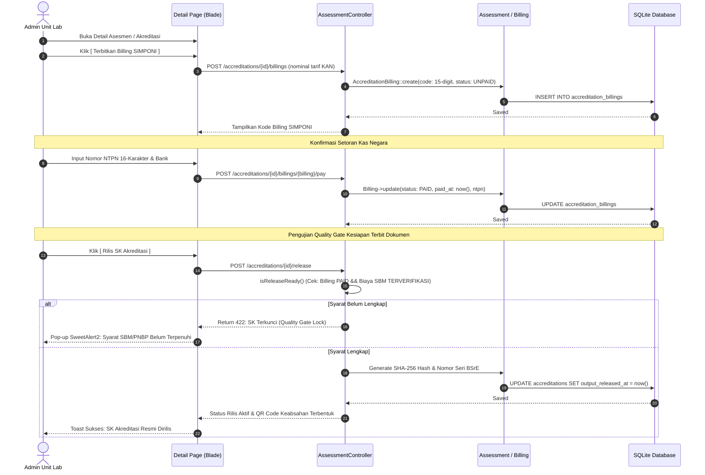
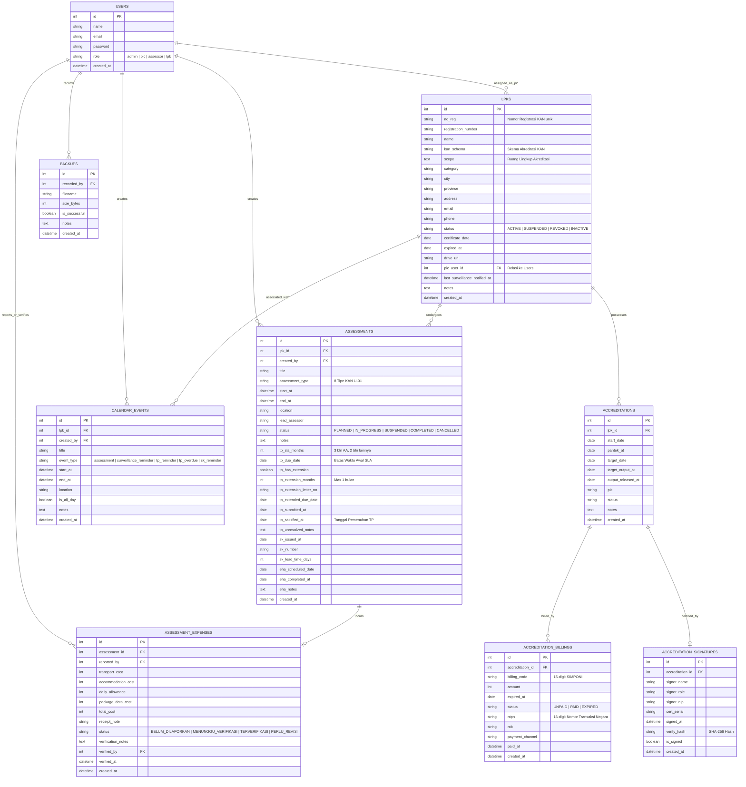
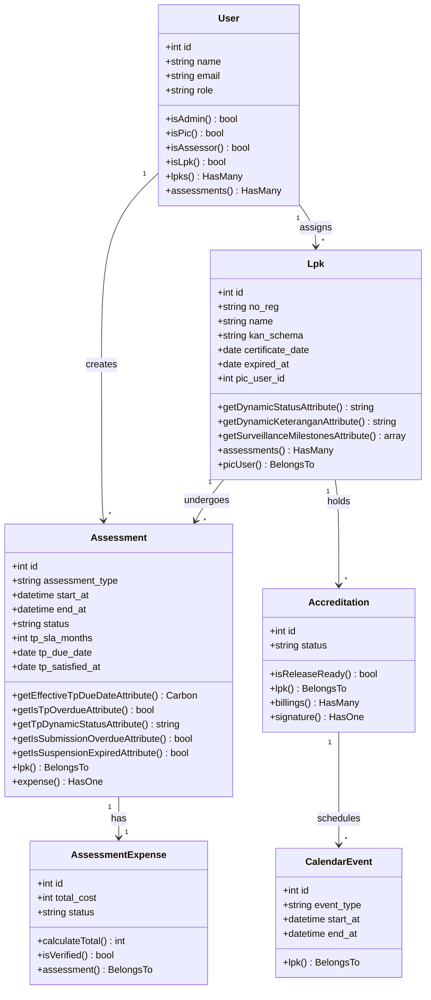

# DOKUMEN PERANCANGAN SISTEM SIMASADI
## Bagian 4: Tahap Perancangan (Design)

---

### 4.1 Struktur Navigasi (Sitemap)

Struktur navigasi menggambarkan alur perpindahan antarmuka pengguna dalam mengakses seluruh menu dan fitur pada sistem SIMASADI. Sesuai dengan pembagian hak akses 4 peran nyata, struktur navigasi dibagi menjadi:
1. **Navigasi Utama Admin & PIC**: Menggambarkan hubungan dari halaman Login, menuju Dashboard utama, hingga ke seluruh menu operasional tingkat satu yang saling terhubung secara horizontal (*bi-directional*).
2. **Navigasi Khusus Portal Asesor & Portal LPK**: Menggambarkan antarmuka terfokus untuk Asesor Lapangan (`/assessor`) dan perwakilan LPK mandiri (`/portal`).
3. **Struktur Navigasi Hierarki Sub-Halaman**: Menggambarkan pohon navigasi dari setiap menu utama hingga ke halaman formulir penambahan, pengubahan, import massal, dan halaman detail data.

#### 4.1.1 Struktur Navigasi Tingkat Utama (Admin & PIC)



<p align="center"><b>Gambar 4. 1 Struktur Navigasi Utama SIMASADI</b></p>

---

#### 4.1.2 Struktur Navigasi Hierarki Sub-Halaman Lengkap

```mermaid
graph TD
    Login["Halaman Login (/login)"] <--> Dash["Dashboard (/dashboard)"]

    Dash --> LPK["Data LPK (/lpks)"]
    LPK <--> LPK_Add["Tambah LPK (/lpks/create)"]
    LPK <--> LPK_Import["Impor LPK (/lpks/import)"]
    LPK <--> LPK_Detail["Detail Profil LPK (/lpks/{id})"]
    LPK_Detail <--> LPK_Edit["Ubah Profil LPK (/lpks/{id}/edit)"]

    Dash --> ASM["Program Asesmen (/assessments)"]
    ASM <--> ASM_Add["Jadwalkan Asesmen (/assessments/create)"]
    ASM <--> ASM_Import["Impor Asesmen (/assessments/import)"]
    ASM <--> ASM_Detail["Detail Asesmen (/assessments/{id})"]
    ASM_Detail <--> ASM_Edit["Ubah Asesmen (/assessments/{id}/edit)"]
    ASM_Detail <--> ASM_Cost["Pelaporan & Verifikasi Biaya SBM"]
    ASM_Detail <--> ASM_TP["Pelacakan Tindakan Perbaikan (SLA)"]
    ASM_Detail <--> ASM_EHA["Evaluasi Hasil Asesmen (EHA)"]

    Dash --> CAL["Kalender Kegiatan (/calendar)"]
    CAL <--> CAL_Add["Klik Tanggal -> Tambah Agenda (/calendar/events/create)"]
    CAL <--> CAL_Detail["Detail Agenda Event (/calendar/events/{id})"]

    Dash --> FIN["Kepatuhan & Finansial"]
    FIN <--> FIN_Bill["Penerbitan Billing SIMPONI & Pembayaran"]
    FIN <--> FIN_Sign["Tanda Tangan Elektronik Dokumen SK (BSrE)"]
    FIN <--> FIN_Gate["Quality Gate Kesiapan Rilis SK"]

    Dash --> USR["Manajemen Pengguna (/users)"]
    USR <--> USR_Add["Tambah Pengguna (/users/create)"]
    USR <--> USR_Edit["Ubah Pengguna (/users/{id}/edit)"]

    Dash --> BCK["Histori Backup (/monitoring/backups)"]

    Dash --> PORTAL_LPK["Portal LPK (/portal) + QR Code"]
    Dash --> PORTAL_ASR["Portal Asesor (/assessor)"]

    classDef pageBox fill:#ffffff,stroke:#2b2b2b,stroke-width:1.5px,color:#111111,font-size:12px;
    class Login,Dash,LPK,LPK_Add,LPK_Import,LPK_Detail,LPK_Edit,ASM,ASM_Add,ASM_Import,ASM_Detail,ASM_Edit,ASM_Cost,ASM_TP,ASM_EHA,CAL,CAL_Add,CAL_Detail,FIN,FIN_Bill,FIN_Sign,FIN_Gate,USR,USR_Add,USR_Edit,BCK,PORTAL_LPK,PORTAL_ASR pageBox;
```



<p align="center"><b>Gambar 4. 2 Struktur Navigasi Hierarki Sub-Halaman SIMASADI</b></p>

---

### 4.2 Use Case Diagram

Diagram Use Case memodelkan fungsi-fungsi sistem dari sudut pandang 4 peran pengguna (*aktor*). Notasi yang digunakan merujuk pada standar UML (*Unified Modeling Language*):
* **Admin Unit Akreditasi Lab (`admin`)**: Pengelola operasional dengan akses menyeluruh.
* **PIC Laboratorium / Unit Teknis (`pic`)**: Pendamping LPK kelolaan.
* **Asesor KAN (`assessor`)**: Tenaga ahli pelaksana asesmen lapangan.
* **Lembaga Penilaian Kesesuaian (`lpk`)**: Entitas pemegang akreditasi KAN.

```mermaid
flowchart LR
    %% Definisi Aktor
    Admin["👤 Admin Unit Lab"]:::actorBox
    PIC["👤 PIC Unit Teknis"]:::actorBox
    Asesor["👤 Asesor KAN"]:::actorBox
    LPK["🏢 Lembaga (LPK)"]:::actorBox

    %% Use Case Kelompok Utama
    UC_Login(["Melakukan Login Sesi"]):::ucMain
    UC_Dash(["Melihat Dashboard & Alert Persisten"]):::ucMain
    UC_LPK_Manage(["Mengelola Data Master LPK"]):::ucMain
    UC_LPK_Import(["Mengimpor Massal LPK & Asesmen"]):::ucMain
    UC_Asm_Manage(["Mengelola 8 Tipe Asesmen KAN"]):::ucMain
    UC_Tolerance(["Memantau Toleransi 3 Tahap & Pembekuan"]):::ucMain
    UC_TP_SLA(["Mengelola SLA Tindakan Perbaikan (TP & VTP)"]): extension:::ucMain
    UC_EHA(["Mencatat Alur Sidang EHA & Lead Time SK"]):::ucMain
    UC_Cal(["Mengelola Kalender Interaktif 5 Event"]):::ucMain
    UC_SBM(["Melaporkan & Memverifikasi Biaya SBM"]):::ucMain
    UC_PNBP(["Menerbitkan Billing SIMPONI & Pelunasan"]):::ucMain
    UC_ESign(["Membubuhi e-Sign BSrE & Rilis SK"]):::ucMain
    UC_QR(["Memverifikasi Status via QR Code"]):::ucMain
    UC_User_Mgmt(["Mengelola Pengguna & Hak Akses"]):::ucMain

    %% Relasi Admin
    Admin --- UC_Login
    Admin --- UC_Dash
    Admin --- UC_LPK_Manage
    Admin --- UC_LPK_Import
    Admin --- UC_Asm_Manage
    Admin --- UC_Tolerance
    Admin --- UC_TP_SLA
    Admin --- UC_EHA
    Admin --- UC_Cal
    Admin --- UC_SBM
    Admin --- UC_PNBP
    Admin --- UC_ESign
    Admin --- UC_User_Mgmt

    %% Relasi PIC
    PIC --- UC_Login
    PIC --- UC_Dash
    PIC --- UC_Tolerance
    PIC --- UC_TP_SLA
    PIC --- UC_Cal
    PIC --- UC_SBM

    %% Relasi Asesor
    Asesor --- UC_Login
    Asesor --- UC_Asm_Manage
    Asesor --- UC_SBM
    Asesor --- UC_TP_SLA

    %% Relasi LPK
    LPK --- UC_Login
    LPK --- UC_Tolerance
    LPK --- UC_TP_SLA
    LPK --- UC_QR

    classDef actorBox fill:#f8fafc,stroke:#334155,stroke-width:1.5px,color:#0f172a,font-weight:bold;
    classDef ucMain fill:#ffffff,stroke:#4f46e5,stroke-width:1.5px,color:#1e1b4b,font-size:12px;
```

<p align="center"><b>Gambar 4. 3 Use Case Diagram Sistem SIMASADI</b></p>

---

### 4.3 Activity Diagram

#### 4.3.1 Activity Diagram: Penegakan Siklus Hidup 3 Tahap Surveilen KAN
Diagram ini memodelkan transisi status pengawasan dari kunjungan asesmen sampai keputusan akhir:



---

#### 4.3.2 Activity Diagram: Alur Pengajuan & Validasi Perpanjangan Waktu SLA Tindakan Perbaikan (TP)



---

### 4.4 Sequence Diagram

#### 4.4.1 Sequence Diagram: Realisasi Pembayaran SIMPONI & Quality Gate Rilis SK



---

### 4.5 Rancangan Basis Data (Entity Relationship Diagram - ERD)

Skema basis data SIMASADI terdiri dari 9 entitas tabel relasional terpadu yang memadukan data master lembaga, agenda lapangan, penegakan regulasi KAN U-01, kepatuhan finansial, serta jejak audit:



<p align="center"><b>Gambar 4. 4 Entity Relationship Diagram (ERD) SIMASADI Terkini</b></p>

---

### 4.6 Class Diagram

Class diagram menggambarkan arsitektur berbasis objek pada layer Model dan Controller di Laravel:



---

### 4.7 Rancangan Antarmuka Pengguna (Wireframe Desktop & Mobile)

#### 4.7.1 Wireframe Halaman Detail Asesmen (Desktop)
```text
+---------------------------------------------------------------------------------------------------+
|  [LOGO BSN/KAN] SIMASADI Workspace                       [Lonceng: 2] [User: Admin Unit Lab v]    |
+---------------------------------------------------------------------------------------------------+
|  <- Kembali ke Daftar Asesmen | No. Reg: LP-001-IDN | Status: [ DIBEKUKAN ] (Badge Ungu)          |
+---------------------------------------------------------------------------------------------------+
|  RINGKASAN ASESMEN                                                                                |
|  * Tipe Asesmen   : Surveilen 1 (S1)           * Tanggal Pelaksanaan : 29/03/2027 s/d 30/03/2027   |
|  * Lead Assessor  : Dr. Ir. Budi Santoso       * Toleransi Pengisian : 31/03/2027 (Lewat Batas)    |
|  * Sisa Pembekuan : 312 Hari (10 Bulan)        * Batas Pencabutan    : 31/03/2028                 |
+---------------------------------------------------------------------------------------------------+
|  [TAB: RINCIAN ASESMEN] | [TAB: TINDAKAN PERBAIKAN (TP)] | [TAB: BIAYA SBM] | [TAB: ALUR EHA & SK] |
+---------------------------------------------------------------------------------------------------+
|  PELACAKAN TINDAKAN PERBAIKAN (SLA KAN):                                                          |
|  * Status TP Otomatis : [ DIBEKUKAN ] (Melewati SLA dasar 2 bulan tanpa pemenuhan)                |
|  * Batas Awal SLA     : 30/05/2027             * Perpanjangan Waktu  : [ Ya ] (Max 1 Bulan)       |
|  * No. Surat Permohonan : 142/LPK-EXT/V/2027   * Batas Perpanjangan  : 30/06/2027                 |
|  * Tanggal Memenuhi   : [ DD/MM/YYYY ] (Input saat perbaikan disetujui lead assessor)             |
+---------------------------------------------------------------------------------------------------+
|  BIAYA PERJALANAN DINAS ASESOR (SBM PMK):                                                         |
|  * Transportasi: Rp 1.500.000  * Uang Harian: Rp 860.000  * Total: Rp 2.360.000                   |
|  * Status Verifikasi: [ TERVERIFIKASI SBM ] (Diverifikasi oleh: Admin pada 01/04/2027)            |
+---------------------------------------------------------------------------------------------------+
|  EVALUASI HASIL ASESMEN & SK KAN:                                                                 |
|  * Tanggal Sidang EHA : 10/07/2027             * No. SK KAN          : 452/KAN/SK/07/2027         |
|  * Tanggal Terbit SK  : 15/07/2027             * Lead Time Terbit SK : 15 Hari                    |
+---------------------------------------------------------------------------------------------------+
```

#### 4.7.2 Wireframe Tampilan Mobile (Responsif & Filter Drawer)
```text
+-----------------------------+
| [=] SIMASADI        [Avatar]|
+-----------------------------+
| ALERT PERSISTEN PRIORITAS   |
| ! 3 Pengawasan Butuh Aksi   |
| [ Tinjau LPK Jatuh Tempo ->]|
+-----------------------------+
| DAFTAR MASTER LPK           |
| [ Filter Data ] [Tabel|Grid]|
| Menampilkan: 10 per halaman |
+-----------------------------+
| +-------------------------+ |
| | LP-001-IDN              | |
| | Balai Besar Pengujian   | |
| | Skema: Lab Uji ISO 17025| |
| | Status: [ DIBEKUKAN ]   | |
| | Sisa Waktu: 10 Bulan    | |
| | [ Detail Asesmen -> ]   | |
| +-------------------------+ |
| | LK-015-IDN              | |
| | Laboratorium Kalibrasi  | |
| | Status: [ AKTIF ]       | |
| | [ Detail Asesmen -> ]   | |
| +-------------------------+ |
+-----------------------------+
```
