# DOKUMEN PERANCANGAN SISTEM SIMASADI
## Bagian 4: Tahap Perancangan (Design)

---

### 4.1 Struktur Navigasi (Sitemap)

Struktur navigasi menggambarkan alur perpindahan antarmuka pengguna dalam mengakses seluruh menu dan fitur pada sistem SIMASADI. Sesuai dengan konvensi perancangan sistem informasi, struktur navigasi dibagi menjadi:
1. **Struktur Navigasi Tingkat Utama (Menu Bar & Sidebar):** Menggambarkan hubungan dari halaman Login, menuju Dashboard utama, hingga ke seluruh menu tingkat satu yang saling terhubung secara horizontal (*bi-directional*).
2. **Struktur Navigasi Hierarki Lengkap (Sub-Menu & Aksi CRUD):** Menggambarkan pohon navigasi dari setiap menu utama hingga ke halaman formulir penambahan, pengubahan, dan halaman detail data.

#### 4.1.1 Struktur Navigasi Tingkat Utama (Admin & Pengguna)
Diagram di bawah mengadopsi model navigasi hierarki dengan bus transfer horizontal antarmenu (dapat berpindah antarmenu secara langsung melalui navigasi sidebar):

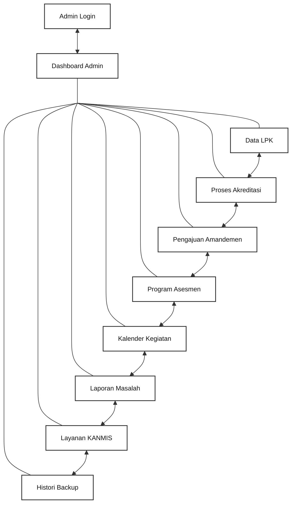

<p align="center"><b>Gambar 3. 1 Struktur Navigasi Admin SIMASADI</b></p>

---

#### 4.1.2 Struktur Navigasi Hierarki Sub-Halaman Lengkap
Diagram berikut merinci sub-halaman formulir aksi (*Create, Read, Update, Detail*) yang dapat diakses dari masing-masing menu utama:

```mermaid
graph TD
    Login["Halaman Login (/login)"] <--> Dash["Dashboard (/dashboard)"]

    Dash --> LPK["Data LPK (/lpks)"]
    LPK <--> LPK_Add["Tambah LPK (/create)"]
    LPK <--> LPK_Detail["Detail Profil (/show)"]
    LPK_Detail <--> LPK_Edit["Ubah Profil (/edit)"]

    Dash --> AKR["Proses Akreditasi (/accreditations)"]
    AKR <--> AKR_Detail["Detail Akreditasi (/show)"]

    Dash --> AMD["Amandemen (/amendments)"]
    AMD <--> AMD_Add["Tambah Amandemen (/create)"]
    AMD <--> AMD_Detail["Detail Amandemen (/show)"]
    AMD_Detail <--> AMD_Edit["Ubah Amandemen (/edit)"]

    Dash --> ASM["Program Asesmen (/assessments)"]
    ASM <--> ASM_Add["Tambah Asesmen (/create)"]
    ASM <--> ASM_Detail["Detail Asesmen (/show)"]
    ASM_Detail <--> ASM_Edit["Ubah Asesmen (/edit)"]

    Dash --> CAL["Kalender Kegiatan (/calendar)"]
    CAL <--> CAL_Add["Klik Tanggal -> Tambah (/events/create)"]
    CAL <--> CAL_Detail["Detail Agenda (/events/show)"]
    CAL_Detail <--> CAL_Edit["Ubah Agenda (/events/edit)"]

    Dash --> ISS["Laporan Masalah (/issues)"]
    ISS <--> ISS_Add["Buat Laporan (/create)"]
    ISS <--> ISS_Detail["Detail & Form Follow-Up (/show)"]

    Dash --> SRV["Layanan KANMIS (/monitoring/services)"]
    Dash --> BCK["Histori Backup (/monitoring/backups)"]

    classDef pageBox fill:#ffffff,stroke:#2b2b2b,stroke-width:1.5px,color:#111111,font-size:12px;
    class Login,Dash,LPK,LPK_Add,LPK_Detail,LPK_Edit,AKR,AKR_Detail,AMD,AMD_Add,AMD_Detail,AMD_Edit,ASM,ASM_Add,ASM_Detail,ASM_Edit,CAL,CAL_Add,CAL_Detail,CAL_Edit,ISS,ISS_Add,ISS_Detail,SRV,BCK pageBox;
```

<p align="center"><b>Gambar 3. 2 Struktur Navigasi Hierarki Sub-Halaman SIMASADI</b></p>

---

### 4.2 Use Case Diagram

Diagram Use Case memodelkan fungsi-fungsi sistem dari sudut pandang pengguna luar (*aktor*). Notasi yang digunakan merujuk pada standar UML (*Unified Modeling Language*), di mana:
* **Aktor (*Actor*):** Pengguna yang berinteraksi dengan sistem (Staf Administrasi Akreditasi, Asesor/Auditor, Administrator Sistem).
* **Use Case:** Fungsi atau skenario kerja sistem yang digambarkan dalam bentuk elips (*oval*).
* **Asosiasi (*Association*):** Garis lurus yang menghubungkan aktor dengan use case utama.
* **`<<include>>`:** Relasi ketergantungan di mana suatu use case wajib memanggil use case lain untuk menyelesaikan fungsinya.
* **`<<extend>>`:** Relasi perluasan opsional di mana suatu use case dapat diperluas fungsinya dalam kondisi tertentu.

#### 4.2.1 Use Case Diagram Pengguna / Asesor SIMASADI
Diagram di bawah menyajikan seluruh fungsionalitas operasional yang dapat diakses oleh pengguna internal sistem:

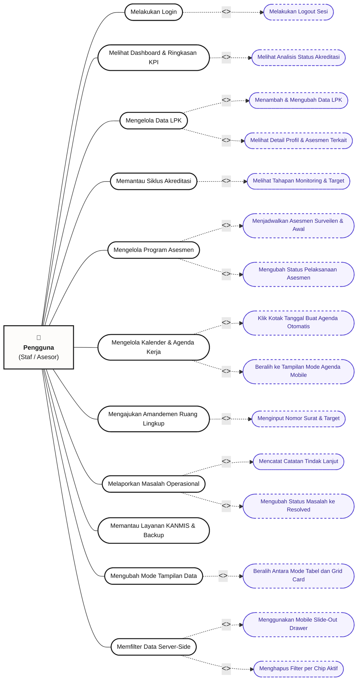

<p align="center"><b>Gambar 3. 3 Use Case Diagram Pengguna SIMASADI</b></p>

---

#### 4.2.2 Tabel Spesifikasi Use Case Kunci

| ID Use Case | Nama Use Case | Aktor | Pre-kondisi | Skenario Alur Utama | Post-kondisi |
|---|---|---|---|---|---|
| **UC-01** | Melakukan Login | Semua Pengguna | Pengguna memiliki email dan password terdaftar. | 1. Buka `/login`.<br/>2. Isi email dan password.<br/>3. Klik Masuk.<br/>4. Sistem memverifikasi kredensial. | Sesi terbuat, diarahkan ke Dashboard. |
| **UC-02** | Melihat Dashboard & Ringkasan KPI | Semua Pengguna | Pengguna telah login. | 1. Akses `/dashboard`.<br/>2. Sistem mengambil agregasi metrik dari database.<br/>3. Sistem merender kartu statistik dan progress bar status akreditasi. | Pengguna melihat statistik dan isu prioritas terkini. |
| **UC-03** | Mengelola Data LPK | Staf / Admin | Pengguna telah login. | 1. Akses `/lpks`.<br/>2. Klik Tambah LPK.<br/>3. Isi nomor registrasi, nama lembaga, kategori, dan kota.<br/>4. Simpan. | LPK baru tersimpan di database dan tampil di daftar. |
| **UC-05** | Mengelola Program Asesmen | Auditor / Staf | Data LPK telah ada di sistem. | 1. Akses `/assessments/create`.<br/>2. Pilih LPK, jenis asesmen, tanggal mulai, dan tanggal selesai.<br/>3. Sistem memvalidasi waktu selesai >= waktu mulai.<br/>4. Simpan. | Jadwal asesmen tersimpan dan tercatat di kalender. |
| **UC-06** | Mengelola Kalender Kerja | Auditor / Staf | Pengguna telah login. | 1. Buka `/calendar`.<br/>2. Klik kotak tanggal tertentu (misal: 24 September).<br/>3. Sistem membuka form dengan tanggal terisi otomatis.<br/>4. Isi judul dan jam kegiatan lalu simpan. | Agenda muncul pada tanggal terkait di kalender. |
| **UC-08** | Melaporkan Masalah & Follow-up | Semua Pengguna | Pengguna menemukan kendala operasional. | 1. Buka `/issues/create`.<br/>2. Pilih LPK, judul, dan tingkat prioritas (High/Medium/Low).<br/>3. Simpan laporan.<br/>4. Pada detail masalah, tulis catatan follow-up dan simpan. | Log tindak lanjut bertambah berantai secara kronologis. |
| **UC-11** | Mengubah Mode Tampilan | Semua Pengguna | Berada pada halaman berdata master (LPK/Asesmen/dll). | 1. Klik tombol toggle [ Grid ] pada toolbar.<br/>2. Layout tabel berganti menjadi kartu 2-kolom terstruktur.<br/>3. Preferensi disimpan ke `localStorage`. | Tampilan data tetap dalam mode Grid saat halaman dimuat ulang. |
| **UC-12** | Memfilter Data Server-Side | Semua Pengguna | Berada pada halaman berdata master. | 1. Pada mobile, klik [ Filter data ] untuk membuka drawer kanan.<br/>2. Pilih kriteria filter dan klik Terapkan.<br/>3. Sistem merefresh data sesuai filter dan menampilkan active chips. | Data tersaring akurat; chip filter dapat dihapus satu per satu. |

---

### 4.3 Activity Diagram (Diagram Aktivitas)

#### 4.3.1 Activity Diagram: Autentikasi Pengguna (Login)
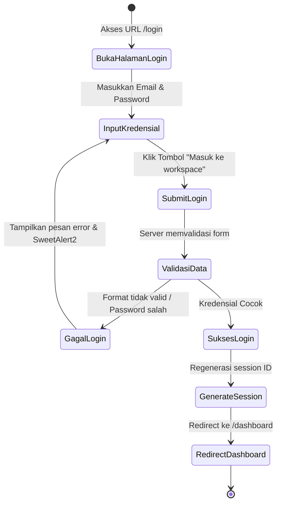

#### 4.3.2 Activity Diagram: Pembuatan Agenda dari Kalender Interaktif
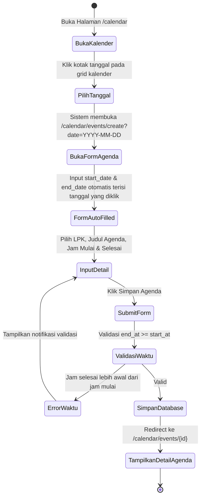

#### 4.3.3 Activity Diagram: Pelaporan Masalah & Penambahan Follow-Up
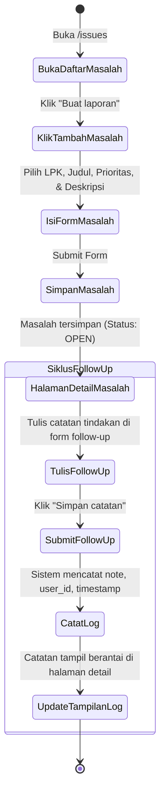

---

### 4.4 Sequence Diagram (Diagram Urutan)

#### 4.4.1 Sequence Diagram: Server-Side Filtering & Toggle Mode Tampilan
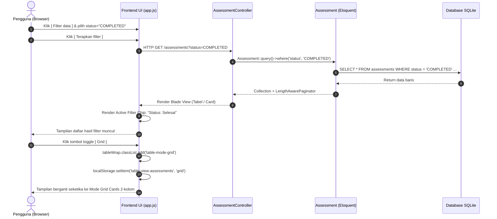

#### 4.4.2 Sequence Diagram: Penambahan Catatan Tindak Lanjut (Follow-Up)
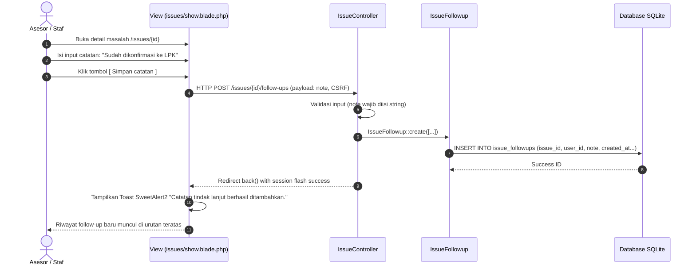

#### 4.4.4 Sequence Diagram: Alur Kepatuhan SIMASADI (Biaya Asesor, Billing PNBP, dan e-Sign BSrE)
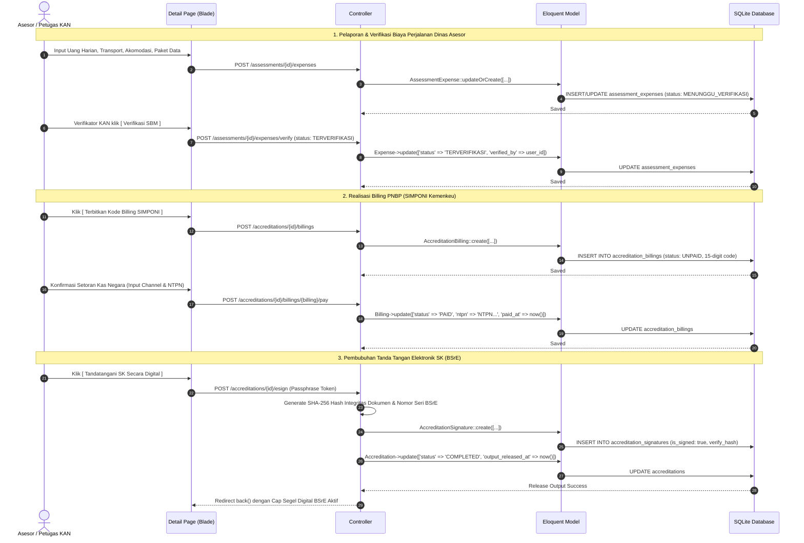

---

### 4.5 Rancangan Basis Data (Entity Relationship Diagram - ERD)

SIMASADI menggunakan skema relasional dengan 14 tabel yang saling terintegrasi mencakup master data, agenda kerja, log kendala, hingga administrasi finansial dan sertifikasi digital:

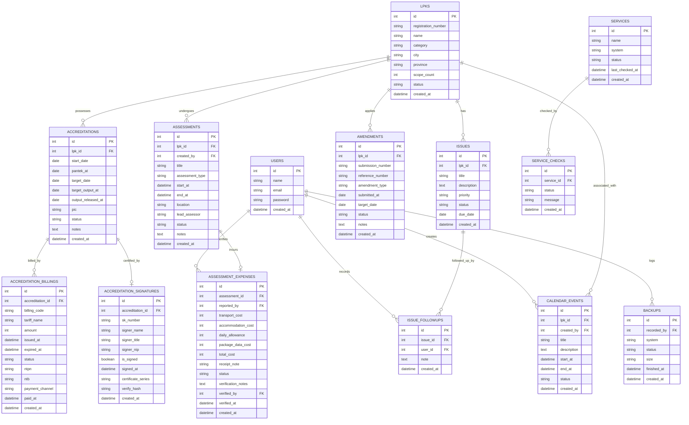

---

### 4.6 Class Diagram

Diagram kelas menyajikan struktur Model Eloquent, Relasi, dan Controller utama dalam aplikasi Laravel:

```mermaid
classDiagram
    direction TB

    class User {
        +int id
        +string name
        +string email
        +calendarEvents() HasMany
        +issueFollowups() HasMany
        +backups() HasMany
    }

    class Lpk {
        +int id
        +string registration_number
        +string name
        +string category
        +string status
        +accreditations() HasMany
        +assessments() HasMany
        +amendments() HasMany
        +issues() HasMany
        +calendarEvents() HasMany
    }

    class Accreditation {
        +int id
        +int lpk_id
        +string status
        +date start_date
        +date target_date
        +lpk() BelongsTo
    }

    class Assessment {
        +int id
        +int lpk_id
        +string title
        +string assessment_type
        +datetime start_at
        +datetime end_at
        +string status
        +lpk() BelongsTo
    }

    class CalendarEvent {
        +int id
        +int lpk_id
        +int created_by
        +string title
        +datetime start_at
        +datetime end_at
        +string status
        +lpk() BelongsTo
        +creator() BelongsTo
    }

    class Issue {
        +int id
        +int lpk_id
        +string title
        +string priority
        +string status
        +lpk() BelongsTo
        +followups() HasMany
    }

    class IssueFollowup {
        +int id
        +int issue_id
        +int user_id
        +text note
        +issue() BelongsTo
        +user() BelongsTo
    }

    class AssessmentExpense {
        +int id
        +int assessment_id
        +int daily_allowance
        +int transport_cost
        +int accommodation_cost
        +int package_data_cost
        +int total_cost
        +string status
        +string receipt_note
        +assessment() BelongsTo
        +isVerified() bool
    }

    class AccreditationBilling {
        +int id
        +int accreditation_id
        +string billing_code
        +int amount
        +string status
        +string ntpn
        +accreditation() BelongsTo
        +isPaid() bool
    }

    class AccreditationSignature {
        +int id
        +int accreditation_id
        +string sk_number
        +string signer_name
        +boolean is_signed
        +string verify_hash
        +accreditation() BelongsTo
    }

    class LpkController {
        +index(Request) View
        +create() View
        +store(Request) Redirect
        +show(Lpk) View
        +edit(Lpk) View
        +update(Request, Lpk) Redirect
    }

    class AssessmentController {
        +index(Request) View
        +create() View
        +store(Request) Redirect
        +show(Assessment) View
        +edit(Assessment) View
        +update(Request, Assessment) Redirect
    }

    class AssessmentExpenseController {
        +storeOrUpdate(Request, Assessment) Redirect
        +verify(Request, Assessment) Redirect
    }

    class AccreditationBillingController {
        +store(Request, Accreditation) Redirect
        +pay(Request, Accreditation, AccreditationBilling) Redirect
    }

    class AccreditationSignatureController {
        +sign(Request, Accreditation) Redirect
        +verifyPublic(string) View
    }

    class CalendarEventController {
        +index(Request) View
        +create(Request) View
        +store(Request) Redirect
        +show(CalendarEvent) View
        +edit(CalendarEvent) View
        +update(Request, CalendarEvent) Redirect
    }

    class IssueController {
        +index(Request) View
        +create() View
        +store(Request) Redirect
        +show(Issue) View
        +update(Request, Issue) Redirect
        +storeFollowup(Request, Issue) Redirect
    }

    Lpk "1" -- "*" Accreditation : has
    Lpk "1" -- "*" Assessment : undergoes
    Lpk "1" -- "*" CalendarEvent : scheduled
    Lpk "1" -- "*" Issue : reports
    Assessment "1" -- "0..1" AssessmentExpense : incurs
    Accreditation "1" -- "*" AccreditationBilling : billed
    Accreditation "1" -- "0..1" AccreditationSignature : signed
    Issue "1" -- "*" IssueFollowup : contains
    User "1" -- "*" IssueFollowup : writes
    User "1" -- "*" CalendarEvent : creates

    LpkController ..> Lpk : uses
    AssessmentController ..> Assessment : uses
    AssessmentExpenseController ..> AssessmentExpense : uses
    AccreditationBillingController ..> AccreditationBilling : uses
    AccreditationSignatureController ..> AccreditationSignature : uses
    CalendarEventController ..> CalendarEvent : uses
    IssueController ..> Issue : uses
    IssueController ..> IssueFollowup : uses
```

---

### 4.7 Rancangan Antarmuka Pengguna (Wireframe)

Berikut adalah representasi tata letak antarmuka halaman-halaman kunci aplikasi SIMASADI:

#### 4.7.1 Wireframe: Dashboard Ringkasan (Desktop)
```text
+----------------------------------------------------------------------------------------------------+
| [Logo BSN] SIMASADI | Sistem Informasi & Administrasi Akreditasi       [Admin (Staf) v] [Logout]   |
+----------------------------------------------------------------------------------------------------+
| [SIDEBAR]       | Ringkasan Operasional                                                            |
| - Ringkasan     | Pantau status LPK, akreditasi, dan jadwal kerja.                                 |
| - Data LPK      | +------------------+ +------------------+ +------------------+ +---------------+ |
| - Akreditasi    | | Total LPK        | | Akreditasi Aktif | | Asesmen Terjadwal| | Masalah Open  | |
| - Amandemen     | | 128              | | 42               | | 18               | | 5             | |
| - Program Ases. | +------------------+ +------------------+ +------------------+ +---------------+ |
| - Kalender      |                                                                                  |
| - Masalah       | +------------------------------------------------------------------------------+ |
| - Layanan       | | Analisis Status Akreditasi                                                   | |
| - Backup        | | [======== 25% Belum Mulai ========][====== 50% Berjalan ======][= 25% Sels=] | |
|                 | +------------------------------------------------------------------------------+ |
|                 | +------------------------------------+ +-------------------------------------+ |
|                 | | Masalah Prioritas Tinggi           | | Aktivitas Asesmen Terkini           | |
|                 | | - PT Qualis (High, Due: 24 Sep)    | | - Surveilen PT Citrabuana (24 Sep)  | |
|                 | | - PT Petrokimia (High, Due: 28 Sep)| | - Asesmen Awal PT Sucofindo (28 Sep)| |
|                 | +------------------------------------+ +-------------------------------------+ |
+----------------------------------------------------------------------------------------------------+
```

#### 4.7.2 Wireframe: Tampilan Tabel Data dengan Tombol Detail Interaktif (Desktop)
```text
+----------------------------------------------------------------------------------------------------+
| Program Asesmen                                                            [+ Tambah Asesmen]      |
| Jadwal dan progres asesmen semua LPK.                                                              |
+----------------------------------------------------------------------------------------------------+
| [Filter: Cari agenda...] [LPK: Semua v] [Jenis: Semua v] [Status: Semua v] [Terapkan Filter] [Reset]|
+----------------------------------------------------------------------------------------------------+
| FILTER AKTIF:  [ Status: Selesai (x) ]   [ Jenis: Surveilen (x) ]                 Reset Filter      |
+----------------------------------------------------------------------------------------------------+
| Show [ 10 v ] entries                                                      [ [=] Tabel | [::] Grid ]|
+----------------------------------------------------------------------------------------------------+
| AGENDA                     | LPK                       | WAKTU             | STATUS       | AKSI   |
+----------------------------+---------------------------+-------------------+--------------+--------+
| Surveilen                  | PT Citrabuana Indoloka    | 24 Sep 2026, 09:00| [Direncanak] |[Detail→|
| REASSESSMENT               |                           |                   |              |        |
+----------------------------+---------------------------+-------------------+--------------+--------+
| Asesmen Awal               | PT Qualis Indonesia       | 25 Sep 2026, 09:00| [Terjadwal ] |[Detail→|
| INITIAL                    |                           |                   |              |        |
+----------------------------+---------------------------+-------------------+--------------+--------+
| Showing 1 to 10 of 18 entries                                                 [<] [1] [2] [>]      |
+----------------------------------------------------------------------------------------------------+
```

#### 4.7.3 Wireframe: Tampilan Mode Grid Card & Penataan Sejajar Mobile (Mobile <= 600px)
```text
+------------------------------------------+
| [=] SIMASADI                    [User v] |
+------------------------------------------+
| Program Asesmen                          |
| [+ Tambah Asesmen]                       |
+------------------------------------------+
| [ ☩ Filter data ]       [ [=]Tab | [::]Grd] |  <-- Sejajar (Side-by-Side)
|                                          |
| Show [ 10 v ] entries                    |
+------------------------------------------+
| +--------------------------------------+ |
| | HEADER: Surveilen                    | |
| | [ REASSESSMENT ]                     | |  <-- Lavender pill badge
| +--------------------------------------+ |
| | LPK     : PT Citrabuana Indoloka     | |
| |           Laboratorium LSPro         | |  <-- Kolom 84px rata rapi
| | WAKTU   : 24 Sep 2026, 09:00         | |
| | STATUS  : [ Direncanakan ]           | |
| +--------------------------------------+ |
| | FOOTER:                 [ Detail → ] | |  <-- Card footer bar
| +--------------------------------------+ |
|                                          |
| +--------------------------------------+ |
| | HEADER: Asesmen Awal                 | |
| | [ INITIAL ]                          | |
| +--------------------------------------+ |
| | LPK     : PT Qualis Indonesia        | |
| | WAKTU   : 25 Sep 2026, 09:00         | |
| | STATUS  : [ Terjadwal ]              | |
| +--------------------------------------+ |
| | FOOTER:                 [ Detail → ] | |
| +--------------------------------------+ |
+------------------------------------------+
```

#### 4.7.4 Wireframe: Kalender Interaktif (Desktop)
```text
+----------------------------------------------------------------------------------------------------+
| Kalender Kegiatan                                           [Mode Kalender | Mode Agenda]          |
| Klik kotak tanggal untuk membuat agenda langsung.                                                  |
+----------------------------------------------------------------------------------------------------+
| < September 2026 >                                                                                 |
+------------+------------+------------+------------+------------+------------+----------------------+
| SEN        | SEL        | RAB        | KAM        | JUM        | SAB        | MIN                  |
+------------+------------+------------+------------+------------+------------+----------------------+
| 1          | 2          | 3          | 4          | 5          | 6          | 7                    |
|            |            |            | [Surveilen]|            |            |                      |
+------------+------------+------------+------------+------------+------------+----------------------+
| 8          | 9          | 10         | 11         | 12         | 13         | 14                   |
|            |            | [Rapat KAN]|            |            |            |                      |
+------------+------------+------------+------------+------------+------------+----------------------+
| 15         | 16         | 17         | 18         | 19 (TODAY) | 20         | 21 (KLIK TANGGAL)    |
|            |            |            |            | [Review]   |            | [ + Buat Agenda... ] |
+------------+------------+------------+------------+------------+------------+----------------------+
```
