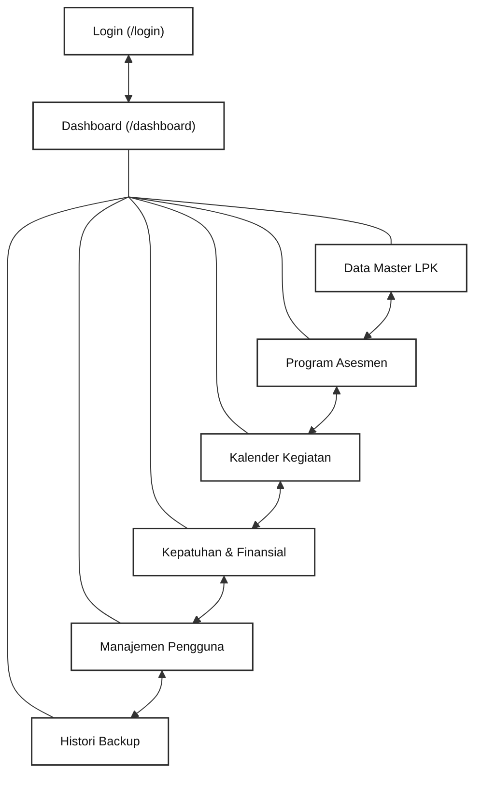
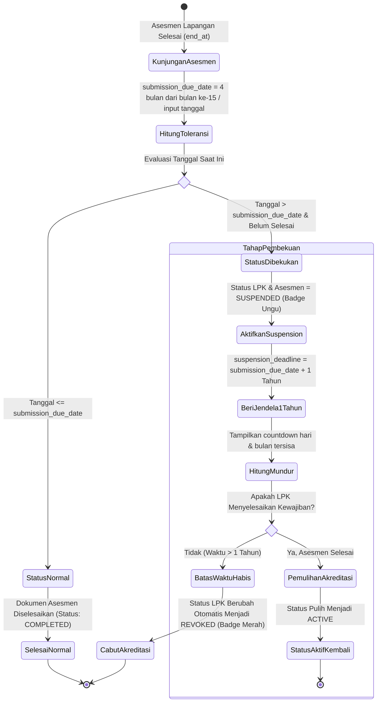
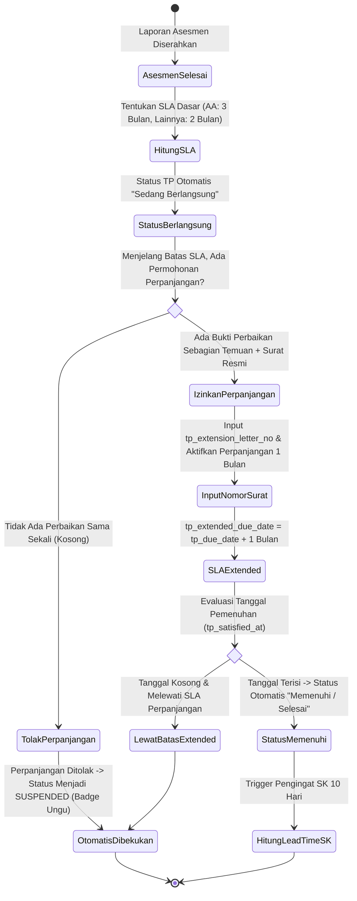
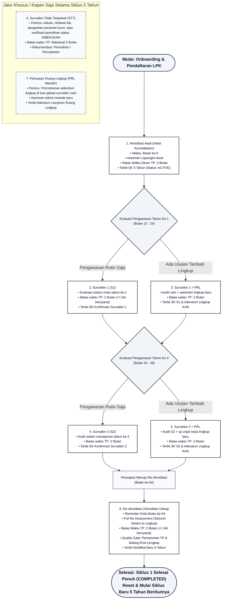
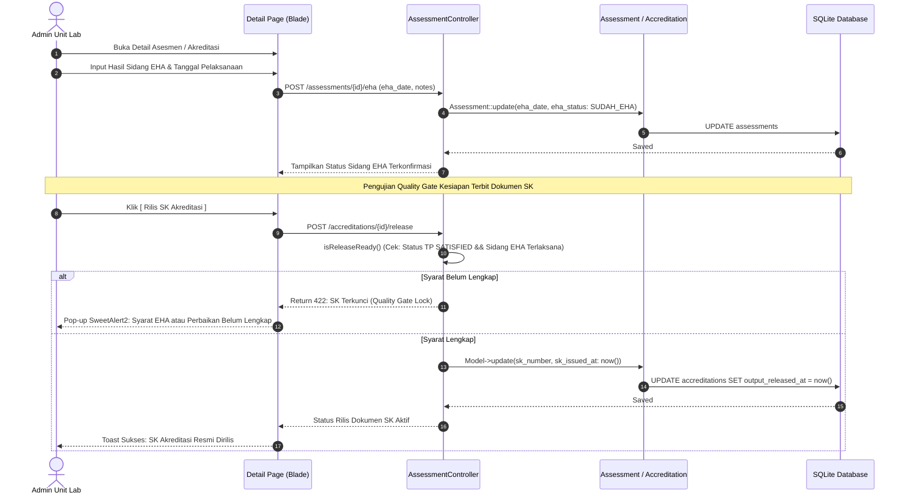
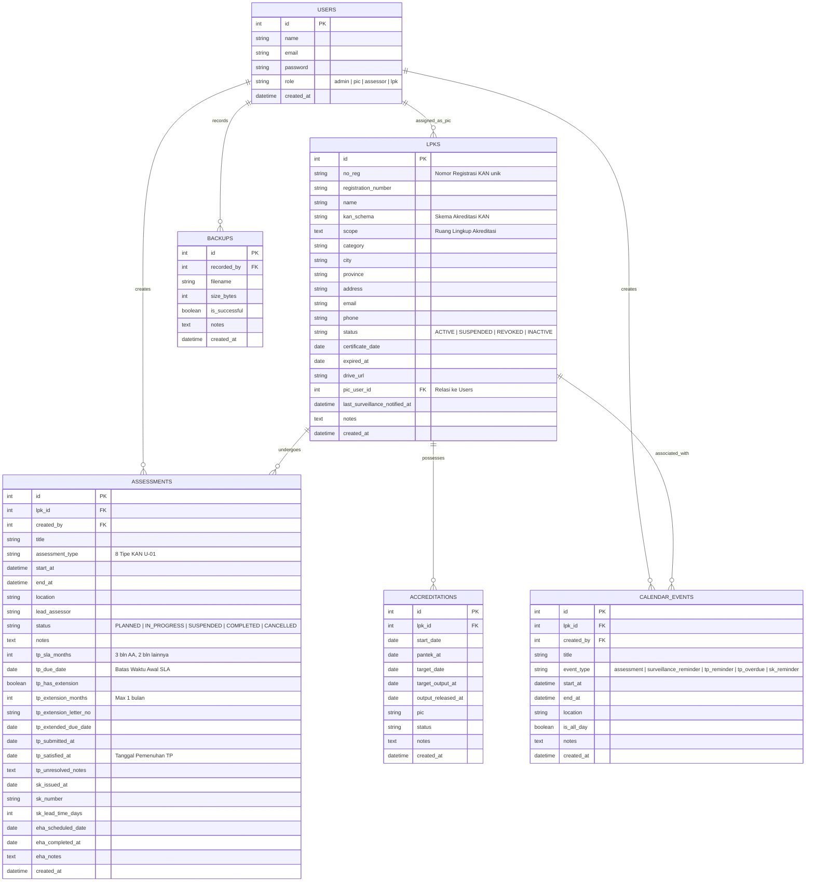
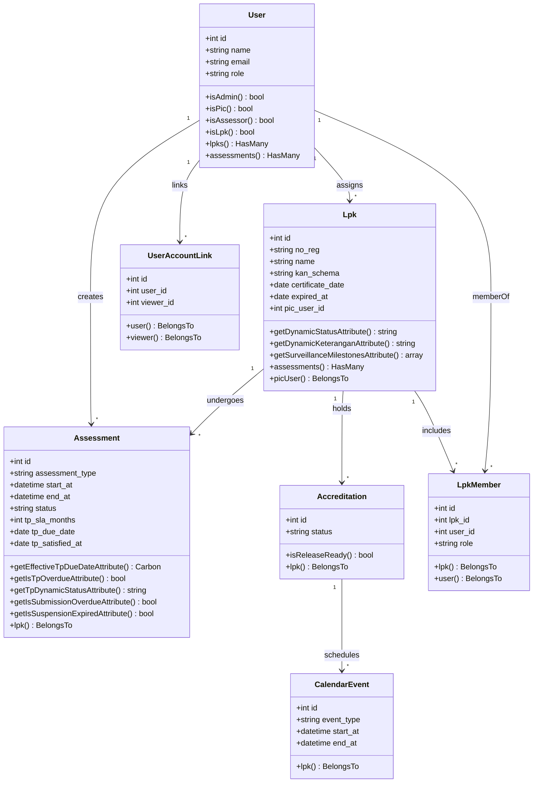

# DOKUMEN PERANCANGAN SISTEM SIMASADI
## Bagian 4: Tahap Perancangan (Design)

---

### 4.1 Struktur Navigasi (Sitemap)

Struktur navigasi menggambarkan alur perpindahan antarmuka pengguna dalam mengakses seluruh menu dan fitur pada sistem SIMASADI. Sesuai dengan pembagian hak akses 4 peran nyata, struktur navigasi dibagi menjadi:
1. **Navigasi Utama Admin & PIC**: Menggambarkan hubungan dari halaman Login, menuju Dashboard utama, hingga ke seluruh menu operasional tingkat satu yang saling terhubung secara horizontal (*bi-directional*).
2. **Navigasi Khusus Portal Asesor & Portal LPK**: Menggambarkan antarmuka terfokus untuk Asesor Lapangan (`/assessor`) dan perwakilan LPK mandiri (`/portal`).
3. **Struktur Navigasi Hierarki Sub-Halaman**: Menggambarkan pohon navigasi dari setiap menu utama hingga ke halaman formulir penambahan, pengubahan, import massal, dan halaman detail data.

#### 4.1.1 Struktur Navigasi Tingkat Utama (Admin & PIC)


```mermaid
graph TD
    UserLogin["Login (/login)"] <--> Dashboard["Dashboard (/dashboard)"]

    Dashboard --- BusTrunk[" "]
    style BusTrunk width:0px,height:0px,stroke:none,fill:none

    BusTrunk --- M1["Data Master LPK"]
    BusTrunk --- M2["Program Asesmen"]
    BusTrunk --- M3["Kalender Kegiatan"]
    BusTrunk --- M4["Kepatuhan & Finansial"]
    BusTrunk --- M5["Manajemen Pengguna"]
    BusTrunk --- M6["Histori Backup"]

    M1 <--> M2
    M2 <--> M3
    M3 <--> M4
    M4 <--> M5
    M5 <--> M6

    classDef navBox fill:#ffffff,stroke:#2b2b2b,stroke-width:1.5px,color:#111111,font-size:13px;
    classDef invisibleTrunk fill:none,stroke:none;
    class UserLogin,Dashboard,M1,M2,M3,M4,M5,M6 navBox;
    class BusTrunk invisibleTrunk;
```

<p align="center"><b>Gambar 4. 1 Struktur Navigasi Utama SIMASADI</b></p>

---

#### 4.1.2 Struktur Navigasi Hierarki Sub-Halaman Lengkap


```mermaid
graph TD
    Login["Halaman Login (/login)"] <--> Dash["Dashboard (/dashboard)"]

    Dash --> LPK["Data LPK (/lpks)"]
    LPK <--> LPK_Add["Tambah LPK (/lpks/create)"]
    LPK <--> LPK_Import["Impor LPK (/lpks/import)"]
    LPK <--> LPK_Detail["Detail Profil LPK (/lpks/{id})"]
    LPK_Detail <--> LPK_Edit["Ubah Profil LPK (/lpks/{id}/edit)"]

    Dash --> ASM["Program Asesmen (/assessments)"]
    ASM <--> ASM_Add["Jadwalkan Asesmen (/assessments/create)"]
    ASM <--> ASM_Import["Impor Asesmen (/assessments/import)"]
    ASM <--> ASM_Detail["Detail Asesmen (/assessments/{id})"]
    ASM_Detail <--> ASM_Edit["Ubah Asesmen (/assessments/{id}/edit)"]
    ASM_Detail <--> ASM_TP["Pelacakan Tindakan Perbaikan (SLA)"]
    ASM_Detail <--> ASM_EHA["Evaluasi Hasil Asesmen (EHA)"]

    Dash --> CAL["Kalender Kegiatan (/calendar)"]
    CAL <--> CAL_Add["Klik Tanggal -> Tambah Agenda (/calendar/events/create)"]
    CAL <--> CAL_Detail["Detail Agenda Event (/calendar/events/{id})"]

    Dash --> VAL["Penerbitan SK & Quality Gate"]
    VAL <--> FIN_Gate["Quality Gate Kesiapan Rilis SK"]

    Dash --> USR["Manajemen Pengguna (/users)"]
    USR <--> USR_Add["Tambah Pengguna (/users/create)"]
    USR <--> USR_Edit["Ubah Pengguna (/users/{id}/edit)"]

    Dash --> ACC_LINKS["Kolaborasi Tim & Tautan Akun (/account-links)"]

    Dash --> PORTAL_ASR["Portal Asesor (/assessor)"]

    classDef pageBox fill:#ffffff,stroke:#2b2b2b,stroke-width:1.5px,color:#111111,font-size:12px;
    class Login,Dash,LPK,LPK_Add,LPK_Import,LPK_Detail,LPK_Edit,ASM,ASM_Add,ASM_Import,ASM_Detail,ASM_Edit,ASM_TP,ASM_EHA,CAL,CAL_Add,CAL_Detail,VAL,FIN_Gate,USR,USR_Add,USR_Edit,ACC_LINKS,PORTAL_ASR pageBox;
```

<p align="center"><b>Gambar 4. 2 Struktur Navigasi Hierarki Sub-Halaman SIMASADI</b></p>

---

### 4.2 Use Case Diagram

Diagram Use Case memodelkan fungsi-fungsi sistem dari sudut pandang 4 peran pengguna (*aktor*). Notasi yang digunakan merujuk pada standar UML (*Unified Modeling Language*):
* **Admin Unit Akreditasi Lab (`admin`)**: Pengelola operasional dengan akses menyeluruh.
* **PIC Laboratorium / Unit Teknis (`pic`)**: Pendamping LPK kelolaan.
* **Asesor KAN (`assessor`)**: Tenaga ahli pelaksana asesmen lapangan.
* **Lembaga Penilaian Kesesuaian (`lpk`)**: Entitas pemegang akreditasi KAN.

```mermaid
flowchart LR
    %% Definisi Aktor
    Admin["👤 Admin Unit Lab"]:::actorBox
    PIC["👤 PIC Unit Teknis"]:::actorBox
    Asesor["👤 Asesor KAN"]:::actorBox
    LPK["🏢 Lembaga (LPK)"]:::actorBox

    %% Use Case Kelompok Utama
    UC_Login(["Melakukan Login Sesi"]):::ucMain
    UC_Dash(["Melihat Dashboard & Alert Persisten"]):::ucMain
    UC_LPK_Manage(["Mengelola Data Master LPK"]):::ucMain
    UC_LPK_Import(["Mengimpor Massal LPK & Asesmen"]):::ucMain
    UC_Asm_Manage(["Mengelola 8 Tipe Asesmen KAN"]):::ucMain
    UC_Tolerance(["Memantau Toleransi 3 Tahap & Pembekuan"]):::ucMain
    UC_TP_SLA(["Mengelola SLA Tindakan Perbaikan (TP & VTP)"]): extension:::ucMain
    UC_EHA(["Mencatat Alur Sidang EHA & Lead Time SK"]):::ucMain
    UC_Cal(["Mengelola Kalender Interaktif 5 Event"]):::ucMain
    UC_Release(["Penerbitan Dokumen SK & Quality Gate"]):::ucMain
    UC_User_Mgmt(["Mengelola Pengguna & Hak Akses"]):::ucMain

    %% Relasi Admin
    Admin --- UC_Login
    Admin --- UC_Dash
    Admin --- UC_LPK_Manage
    Admin --- UC_LPK_Import
    Admin --- UC_Asm_Manage
    Admin --- UC_Tolerance
    Admin --- UC_TP_SLA
    Admin --- UC_EHA
    Admin --- UC_Cal
    Admin --- UC_Release
    Admin --- UC_User_Mgmt

    %% Relasi PIC
    PIC --- UC_Login
    PIC --- UC_Dash
    PIC --- UC_Tolerance
    PIC --- UC_TP_SLA
    PIC --- UC_Cal

    %% Relasi Asesor
    Asesor --- UC_Login
    Asesor --- UC_Asm_Manage
    Asesor --- UC_TP_SLA

    %% Relasi LPK
    LPK --- UC_Login
    LPK --- UC_Tolerance
    LPK --- UC_TP_SLA

    classDef actorBox fill:#f8fafc,stroke:#334155,stroke-width:1.5px,color:#0f172a,font-weight:bold;
    classDef ucMain fill:#ffffff,stroke:#4f46e5,stroke-width:1.5px,color:#1e1b4b,font-size:12px;
```

<p align="center"><b>Gambar 4. 3 Use Case Diagram Sistem SIMASADI</b></p>

---

### 4.3 Activity Diagram

#### 4.3.1 Activity Diagram: Penegakan Siklus Hidup 3 Tahap Surveilen KAN
Diagram ini memodelkan transisi status pengawasan dari kunjungan asesmen sampai keputusan akhir:


```mermaid
stateDiagram-v2
    [*] --> KunjunganAsesmen: Asesmen Lapangan Selesai (end_at)
    KunjunganAsesmen --> HitungToleransi: submission_due_date = 4 bulan dari bulan ke-15 / input tanggal
    
    state CekBulanKunjungan <<choice>>
    HitungToleransi --> CekBulanKunjungan: Evaluasi Tanggal Saat Ini
    CekBulanKunjungan --> StatusNormal: Tanggal <= submission_due_date
    StatusNormal --> SelesaiNormal: Dokumen Asesmen Diselesaikan (Status: COMPLETED)
    SelesaiNormal --> [*]
    
    CekBulanKunjungan --> StatusDibekukan: Tanggal > submission_due_date & Belum Selesai
    
    state TahapPembekuan {
        StatusDibekukan --> AktifkanSuspension: Status LPK & Asesmen = SUSPENDED (Badge Ungu)
        AktifkanSuspension --> BeriJendela1Tahun: suspension_deadline = submission_due_date + 1 Tahun
        BeriJendela1Tahun --> HitungMundur: Tampilkan countdown hari & bulan tersisa
        
        state CekPenyelesaian1Tahun <<choice>>
        HitungMundur --> CekPenyelesaian1Tahun: Apakah LPK Menyelesaikan Kewajiban?
        CekPenyelesaian1Tahun --> PemulihanAkreditasi: Ya, Asesmen Selesai
        PemulihanAkreditasi --> StatusAktifKembali: Status Pulih Menjadi ACTIVE
        StatusAktifKembali --> [*]
        
        CekPenyelesaian1Tahun --> BatasWaktuHabis: Tidak (Waktu > 1 Tahun)
    }
    
    BatasWaktuHabis --> CabutAkreditasi: Status LPK Berubah Otomatis Menjadi REVOKED (Badge Merah)
    CabutAkreditasi --> [*]
```

---

#### 4.3.2 Activity Diagram: Alur Pengajuan & Validasi Perpanjangan Waktu SLA Tindakan Perbaikan (TP)


```mermaid
stateDiagram-v2
    [*] --> AsesmenSelesai: Laporan Asesmen Diserahkan
    AsesmenSelesai --> HitungSLA: Tentukan SLA Dasar (AA: 3 Bulan, Lainnya: 2 Bulan)
    HitungSLA --> StatusBerlangsung: Status TP Otomatis "Sedang Berlangsung"
    
    state CekProgresTemuan <<choice>>
    StatusBerlangsung --> CekProgresTemuan: Menjelang Batas SLA, Ada Permohonan Perpanjangan?
    
    CekProgresTemuan --> TolakPerpanjangan: Tidak Ada Perbaikan Sama Sekali (Kosong)
    TolakPerpanjangan --> OtomatisDibekukan: Perpanjangan Ditolak -> Status Menjadi SUSPENDED (Badge Ungu)
    OtomatisDibekukan --> [*]
    
    CekProgresTemuan --> IzinkanPerpanjangan: Ada Bukti Perbaikan Sebagian Temuan + Surat Resmi
    IzinkanPerpanjangan --> InputNomorSurat: Input tp_extension_letter_no & Aktifkan Perpanjangan 1 Bulan
    InputNomorSurat --> SLAExtended: tp_extended_due_date = tp_due_date + 1 Bulan
    
    state CekPemenuhan <<choice>>
    SLAExtended --> CekPemenuhan: Evaluasi Tanggal Pemenuhan (tp_satisfied_at)
    CekPemenuhan --> StatusMemenuhi: Tanggal Terisi -> Status Otomatis "Memenuhi / Selesai"
    StatusMemenuhi --> HitungLeadTimeSK: Trigger Pengingat SK 10 Hari
    HitungLeadTimeSK --> [*]
    
    CekPemenuhan --> LewatBatasExtended: Tanggal Kosong & Melewati SLA Perpanjangan
    LewatBatasExtended --> OtomatisDibekukan
```

---

#### 4.3.3 Activity Diagram: Alur Kerja Lengkap PIC dalam 1 Siklus Akreditasi Penuh (8 Tahapan KAN)

Diagram ini memodelkan aktivitas PIC Laboratorium dalam mendampingi dan mengawal LPK binaannya mulai dari pendaftaran awal hingga menyelesaikan seluruh 8 tahapan dalam satu siklus akreditasi 5 tahun penuh (60 bulan) sesuai regulasi KAN U-01 dan otomasi sistem SIMASADI:


```mermaid
flowchart TD
    Start(["Mulai: Onboarding & Pendaftaran LPK"]):::nodeStart --> Stage1["1. Akreditasi Awal (Initial Accreditation)<br/>• Waktu: Bulan ke-0<br/>• Asesmen Lapangan Awal<br/>• Batas Waktu Dasar TP: 3 Bulan<br/>• Terbit SK 5 Tahun (Status: ACTIVE)"]:::stageBox

    Stage1 --> EvalY1{"Evaluasi Pengawasan Tahun Ke-1<br/>(Bulan 13 - 24)"}:::decisionBox

    EvalY1 -- "Pengawasan Rutin Saja" --> Stage2["2. Survailen 1 (S1)<br/>• Evaluasi sistem mutu tahun ke-1<br/>• Batas waktu TP: 2 Bulan (+1 bln bersyarat)<br/>• Terbit SK Konfirmasi Survailen 1"]:::stageBox
    EvalY1 -- "Ada Usulan Tambah Lingkup" --> Stage3["3. Survailen 1 + PRL<br/>• Audit rutin + asesmen lingkup baru<br/>• Batas waktu TP: 2 Bulan<br/>• Terbit SK S1 & Adendum Lingkup KAN"]:::stageBox

    Stage2 --> EvalY3{"Evaluasi Pengawasan Tahun Ke-3<br/>(Bulan 34 - 48)"}:::decisionBox
    Stage3 --> EvalY3

    EvalY3 -- "Pengawasan Rutin Saja" --> Stage4["4. Survailen 2 (S2)<br/>• Audit sistem manajemen tahun ke-3<br/>• Batas waktu TP: 2 Bulan<br/>• Terbit SK Konfirmasi Survailen 2"]:::stageBox
    EvalY3 -- "Ada Usulan Tambah Lingkup" --> Stage5["5. Survailen 2 + PRL<br/>• Audit S2 + uji unjuk kerja lingkup baru<br/>• Batas waktu TP: 2 Bulan<br/>• Terbit SK S2 & Adendum Lingkup KAN"]:::stageBox

    Stage4 --> TrackReAkreditasi["Persiapan Menuju Re-Akreditasi<br/>(Bulan ke-54)"]:::transBox
    Stage5 --> TrackReAkreditasi

    subgraph Insidental["Jalur Khusus / Kapan Saja Selama Siklus 5 Tahun"]
        Stage6["6. Survailen Tidak Terjadwal (STT)<br/>• Pemicu: Aduan, relokasi lab, pergantian personel kunci, atau verifikasi pemulihan status DIBEKUKAN<br/>• Batas waktu TP: Maksimal 2 Bulan<br/>• Rekomendasi: Pemulihan / Pencabutan"]:::sideBox
        Stage7["7. Perluasan Ruang Lingkup (PRL Mandiri)<br/>• Pemicu: Permohonan adendum lingkup di luar jadwal surveilen rutin<br/>• Asesmen teknis metode baru<br/>• Terbit Adendum Lampiran Ruang Lingkup"]:::sideBox
    end

    TrackReAkreditasi --> Stage8["8. Re-Akreditasi (Akreditasi Ulang)<br/>• Reminder Kritis Bulan ke-54<br/>• Full Re-Assessment (Seluruh Sistem & Lingkup)<br/>• Batas Waktu TP: 2 Bulan (+1 bln bersyarat)<br/>• Quality Gate: Pemenuhan TP & Sidang EHA Lengkap<br/>• Terbit Sertifikat Baru 5 Tahun"]:::stageBox

    Stage8 --> EndNode(["Selesai: Siklus 1 Selesai Penuh (COMPLETED)<br/>Reset & Mulai Siklus Baru 5 Tahun Berikutnya"]):::nodeEnd

    classDef stageBox fill:#ffffff,stroke:#1e293b,stroke-width:1.5px,color:#0f172a,font-size:12px;
    classDef decisionBox fill:#f1f5f9,stroke:#0f172a,stroke-width:1.5px,color:#0f172a,font-size:12px;
    classDef sideBox fill:#f8fafc,stroke:#475569,stroke-dasharray: 4 4,stroke-width:1.5px,color:#0f172a,font-size:12px;
    classDef nodeStart fill:#f1f5f9,stroke:#0f172a,stroke-width:1.5px,color:#0f172a,font-weight:bold;
    classDef nodeEnd fill:#f1f5f9,stroke:#0f172a,stroke-width:1.5px,color:#0f172a,font-weight:bold;
    classDef transBox fill:#f8fafc,stroke:#64748b,stroke-width:1.5px,color:#0f172a,font-size:12px;
```

<p align="center"><b>Gambar 4. 4 Activity Diagram Alur Kerja PIC dalam 1 Siklus Akreditasi Penuh (8 Tahapan KAN)</b></p>

##### Ringkasan Matriks Tanggung Jawab PIC per Tahap:

| No | Tahap Siklus | Waktu Acuan KAN | Aktivitas Utama PIC | Otomasi SIMASADI | Output Akhir |
|---|---|---|---|---|---|
| 1 | **Akreditasi Awal** | Bulan ke-0 | Verifikasi dokumen legalitas, manual mutu, jadwal asesmen, pendampingan perbaikan (batas waktu 3 bulan), koordinasi VTP | Generate no_reg unik, set batas waktu TP = 3 bulan, catat certificate_date | Sertifikat & SK Akreditasi 5 Tahun (ACTIVE) |
| 2 | **Survailen 1 (S1)** | Bulan 13 - 24 | Pantau reminder dasbor, jadwalkan kunjungan S1, kawal TP 2 bulan (+1 bln jika progres nyata), koordinasi pelaksanaan asesmen | Reminder berkala kalender, toleransi pengisian maks 4 bln dr bln 15, trigger SK 10 hari | SK Konfirmasi Survailen 1 |
| 3 | **Survailen 1 + PRL** | Bulan 13 - 24 | Verifikasi portofolio metode baru, susun tim gabungan asesmen sistem + teknis, kawal audit simultan dan TP 2 bulan | Jadwal gabungan, pemetaan lingkup baru ke master data, pelacakan terpadu | SK S1 + Adendum Lampiran Lingkup Baru |
| 4 | **Survailen 2 (S2)** | Bulan 34 - 48 | Pantau reminder S2 (maks 2 tahun pasca S1), evaluasi kaji ulang manajemen, kawal pemenuhan perbaikan 2 bulan | Reminder kalender multi-event, countdown pembekuan dinamis jika wanprestasi | SK Konfirmasi Survailen 2 |
| 5 | **Survailen 2 + PRL** | Bulan 34 - 48 | Verifikasi kesiapan alat & uji profisiensi lingkup baru, koordinasi asesmen gabungan, kawal TP 2 bulan | Sinkronisasi multi-skema, kontrol batas waktu terpadu, hitung lead time SK | SK S2 + Adendum Pembaruan Ruang Lingkup |
| 6 | **Survailen Tidak Terjadwal (STT)** | Insidental | Terima aduan publik, relokasi lab, pergantian personel kunci, koordinasi asesmen khusus, kawal TP maks 2 bulan | Penandaan event insidental di kalender, alert persisten prioritas tinggi | Rekomendasi EHA: Pemulihan / Pencabutan |
| 7 | **Perluasan Ruang Lingkup (PRL)** | Mandiri | Reviu permohonan mandiri di luar jadwal rutin, cek bukti validasi metode, input asesmen teknis, kawal TP 2 bulan | Registrasi asesmen PRL, validasi kelengkapan berkas penambahan lingkup | Adendum Lampiran Ruang Lingkup Resmi |
| 8 | **Re-Akreditasi** | Bulan 54 - 60 | Kirim notifikasi Bulan ke-54, reviu berkas lengkap, kawal full re-assessment, kawal Quality Gate kelengkapan EHA & perbaikan | Persistent alert banner kritis, Quality Gate lock rilis SK, reset siklus baru | Sertifikat & SK Baru 5 Tahun (Siklus 2) |

---

### 4.4 Sequence Diagram

#### 4.4.1 Sequence Diagram: Verifikasi Alur EHA & Quality Gate Rilis SK


```mermaid
sequenceDiagram
    autonumber
    actor Admin as Admin Unit Lab
    participant View as Detail Page (Blade)
    participant Ctrl as AssessmentController
    participant Model as Assessment / Accreditation
    participant DB as SQLite Database

    Admin->>View: Buka Detail Asesmen / Akreditasi
    Admin->>View: Input Hasil Sidang EHA & Tanggal Pelaksanaan
    View->>Ctrl: POST /assessments/{id}/eha (eha_date, notes)
    Ctrl->>Model: Assessment::update(eha_date, eha_status: SUDAH_EHA)
    Model->>DB: UPDATE assessments
    DB-->>Ctrl: Saved
    Ctrl-->>View: Tampilkan Status Sidang EHA Terkonfirmasi

    Note over Admin,DB: Pengujian Quality Gate Kesiapan Terbit Dokumen SK
    Admin->>View: Klik [ Rilis SK Akreditasi ]
    View->>Ctrl: POST /accreditations/{id}/release
    Ctrl->>Ctrl: isReleaseReady() (Cek: Status TP SATISFIED && Sidang EHA Terlaksana)
    alt Syarat Belum Lengkap
        Ctrl-->>View: Return 422: SK Terkunci (Quality Gate Lock)
        View-->>Admin: Pop-up SweetAlert2: Syarat EHA atau Perbaikan Belum Lengkap
    else Syarat Lengkap
        Ctrl->>Model: Model->update(sk_number, sk_issued_at: now())
        Model->>DB: UPDATE accreditations SET output_released_at = now()
        DB-->>Ctrl: Saved
        Ctrl-->>View: Status Rilis Dokumen SK Aktif
        View-->>Admin: Toast Sukses: SK Akreditasi Resmi Dirilis
    end
```

---

### 4.5 Rancangan Basis Data (Entity Relationship Diagram - ERD)

Skema basis data SIMASADI terdiri dari 6 entitas tabel relasional terpadu yang memadukan data master lembaga, agenda lapangan, penegakan regulasi KAN U-01, penetapan dokumen akreditasi, serta jejak audit:


```mermaid
erDiagram
    USERS ||--o{ LPKS : "assigned_as_pic"
    USERS ||--o{ ASSESSMENTS : "creates"
    USERS ||--o{ CALENDAR_EVENTS : "creates"
    USERS ||--o{ BACKUPS : "records"

    LPKS ||--o{ ASSESSMENTS : "undergoes"
    LPKS ||--o{ ACCREDITATIONS : "possesses"
    LPKS ||--o{ CALENDAR_EVENTS : "associated_with"

    USERS {
        int id PK
        string name
        string email
        string password
        string role "admin | pic | assessor | lpk"
        datetime created_at
    }

    LPKS {
        int id PK
        string no_reg "Nomor Registrasi KAN unik"
        string registration_number
        string name
        string kan_schema "Skema Akreditasi KAN"
        text scope "Ruang Lingkup Akreditasi"
        string category
        string city
        string province
        string address
        string email
        string phone
        string status "ACTIVE | SUSPENDED | REVOKED | INACTIVE"
        date certificate_date
        date expired_at
        string drive_url
        int pic_user_id FK "Relasi ke Users"
        datetime last_surveillance_notified_at
        text notes
        datetime created_at
    }

    ASSESSMENTS {
        int id PK
        int lpk_id FK
        int created_by FK
        string title
        string assessment_type "8 Tipe KAN U-01"
        datetime start_at
        datetime end_at
        string location
        string lead_assessor
        string status "PLANNED | IN_PROGRESS | SUSPENDED | COMPLETED | CANCELLED"
        text notes
        int tp_sla_months "3 bln AA, 2 bln lainnya"
        date tp_due_date "Batas Waktu Awal SLA"
        boolean tp_has_extension
        int tp_extension_months "Max 1 bulan"
        string tp_extension_letter_no
        date tp_extended_due_date
        date tp_submitted_at
        date tp_satisfied_at "Tanggal Pemenuhan TP"
        text tp_unresolved_notes
        date sk_issued_at
        string sk_number
        int sk_lead_time_days
        date eha_scheduled_date
        date eha_completed_at
        text eha_notes
        datetime created_at
    }

    ACCREDITATIONS {
        int id PK
        int lpk_id FK
        date start_date
        date pantek_at
        date target_date
        date target_output_at
        date output_released_at
        string pic
        string status
        text notes
        datetime created_at
    }

    CALENDAR_EVENTS {
        int id PK
        int lpk_id FK
        int created_by FK
        string title
        string event_type "assessment | surveillance_reminder | tp_reminder | tp_overdue | sk_reminder"
        datetime start_at
        datetime end_at
        string location
        boolean is_all_day
        text notes
        datetime created_at
    }

    BACKUPS {
        int id PK
        int recorded_by FK
        string filename
        int size_bytes
        boolean is_successful
        text notes
        datetime created_at
    }
```

<p align="center"><b>Gambar 4. 5 Entity Relationship Diagram (ERD) SIMASADI Terkini</b></p>

---

#### 4.5.1 Kamus Data & Struktur Tabel SIMASADI (Data Dictionary)

Rancangan struktur basis data SIMASADI terdiri dari 7 entitas tabel relasional terpadu. Rincian struktur kolom, tipe data, kunci (key), dan deskripsi operasional masing-masing tabel adalah sebagai berikut:

##### 1. Tabel `users` (Data Pengguna & Hak Akses Sistem)
| no | nama kolom | tipe data dan panjang | key | keterangan |
|:--:|---|---|:--:|---|
| 1 | id | BIGINT (20) | Primary Key (PK) | Identifier unik data pengguna sistem |
| 2 | name | VARCHAR (255) | - | Nama lengkap pengguna atau personel pengelola |
| 3 | email | VARCHAR (255) | Unique Key | Alamat surat elektronik unik untuk otentikasi login |
| 4 | email_verified_at | TIMESTAMP | - | Waktu verifikasi alamat email pengguna |
| 5 | password | VARCHAR (255) | - | Kata sandi pengguna terenkripsi hash Bcrypt / Argon2id |
| 6 | role | VARCHAR (50) | - | Hak akses peran: admin, pic, assessor, atau lpk |
| 7 | remember_token | VARCHAR (100) | - | Token acak persistensi sesi login Remember Me |
| 8 | created_at | TIMESTAMP | - | Waktu pembuatan data pengguna |
| 9 | updated_at | TIMESTAMP | - | Waktu pembaruan terakhir data pengguna |

##### 2. Tabel `lpks` (Master Data Lembaga Penilaian Kesesuaian)
| no | nama kolom | tipe data dan panjang | key | keterangan |
|:--:|---|---|:--:|---|
| 1 | id | BIGINT (20) | Primary Key (PK) | Identifier unik data LPK / laboratorium |
| 2 | registration_number | VARCHAR (100) | - | Nomor identitas registrasi internal laboratorium |
| 3 | no_reg | VARCHAR (100) | Unique Key | Nomor registrasi resmi KAN (contoh: LP-001-IDN, LK-015-IDN) |
| 4 | name | VARCHAR (255) | - | Nama resmi laboratorium atau badan hukum LPK |
| 5 | accreditation_type | VARCHAR (100) | - | Kategori skema akreditasi (Lab Penguji, Kalibrasi, Medik) |
| 6 | accreditation_number | VARCHAR (100) | - | Nomor sertifikat akreditasi atau nomor referensi legalitas |
| 7 | scope | TEXT | - | Ringkasan lingkup bidang pengujian / kalibrasi |
| 8 | address | TEXT | - | Alamat fisik fasilitas laboratorium |
| 9 | email | VARCHAR (255) | - | Alamat email resmi kontak operasional laboratorium |
| 10 | phone | VARCHAR (50) | - | Nomor kontak telepon / narahubung laboratorium |
| 11 | status | VARCHAR (50) | - | Status siklus: ACTIVE, SUSPENDED, REVOKED, atau INACTIVE |
| 12 | certificate_date | DATE | - | Tanggal penetapan sertifikat (patokan siklus pengawasan 5 tahun) |
| 13 | expired_at | DATE | - | Tanggal akhir masa berlaku sertifikat akreditasi (5 tahun) |
| 14 | drive_url | TEXT | - | Tautan penyimpanan cloud berkas profil laboratorium |
| 15 | pic_id | BIGINT (20) | Foreign Key (FK) | Relasi ke users.id sebagai PIC pendamping laboratorium |
| 16 | last_surveillance_notified_at | TIMESTAMP | - | Riwayat waktu pengiriman simulasi reminder surveilen |
| 17 | notes | TEXT | - | Catatan teknis atau keterangan operasional khusus |
| 18 | created_at | TIMESTAMP | - | Waktu pembuatan data LPK |
| 19 | updated_at | TIMESTAMP | - | Waktu pembaruan terakhir data LPK |

##### 3. Tabel `assessments` (Program & Pelaksanaan Asesmen KAN)
| no | nama kolom | tipe data dan panjang | key | keterangan |
|:--:|---|---|:--:|---|
| 1 | id | BIGINT (20) | Primary Key (PK) | Identifier unik kegiatan asesmen laboratorium |
| 2 | lpk_id | BIGINT (20) | Foreign Key (FK) | Relasi ke lpks.id laboratorium yang dinilai |
| 3 | created_by | BIGINT (20) | Foreign Key (FK) | Relasi ke users.id pembuat agenda asesmen |
| 4 | title | VARCHAR (255) | - | Judul deskriptif pelaksanaan kegiatan asesmen |
| 5 | assessment_type | VARCHAR (50) | - | 8 Tipe KAN U-01: INITIAL, SURVEILLANCE_1, S1_PRL, S2, dll |
| 6 | start_at | DATETIME | - | Tanggal dan waktu dimulainya asesmen lapangan |
| 7 | end_at | DATETIME | - | Tanggal dan waktu berakhirnya kunjungan (acuan batas waktu) |
| 8 | submission_due_date | DATE | - | Batas toleransi pengisian dokumen asesmen (default 4 bulan dari bulan ke-15 siklus akreditasi / tanggal kunjungan, dapat diedit) |
| 9 | location | VARCHAR (255) | - | Lokasi fisik pelaksanaan audit lapangan |
| 10 | lead_assessor | VARCHAR (255) | - | Nama Asesor Kepala yang ditugaskan memimpin audit |
| 11 | assessment_team | TEXT | - | Daftar anggota tim penilai dan tenaga ahli teknis |
| 12 | status | VARCHAR (50) | - | Status asesmen: PLANNED, IN_PROGRESS, SUSPENDED, COMPLETED |
| 13 | tp_status | VARCHAR (50) | - | Status perbaikan: NONE, IN_PROGRESS, EXTENDED, SATISFIED, OVERDUE |
| 14 | tp_due_date | DATE | - | Batas waktu awal perbaikan (3 bln AA, 2 bln lainnya) |
| 15 | tp_has_extension | TINYINT (1) | - | Status perpanjangan waktu (0 = Tidak, 1 = Disetujui) |
| 16 | tp_extension_months | INTEGER | - | Durasi perpanjangan yang disetujui (maksimal 1 bulan kalender) |
| 17 | tp_extension_letter_no | VARCHAR (100) | - | Nomor surat permohonan resmi perpanjangan dari LPK |
| 18 | tp_extension_date | DATE | - | Tanggal pencatatan persetujuan perpanjangan waktu |
| 19 | tp_extension_notes | TEXT | - | Catatan justifikasi dan bukti progres nyata perbaikan |
| 20 | tp_satisfied_at | DATE | - | Tanggal pemenuhan seluruh tindakan perbaikan disetujui |
| 21 | tp_notes | TEXT | - | Rekaman temuan ketidaksesuaian dan tindakan perbaikan |
| 22 | report_date | DATE | - | Tanggal penyelesaian laporan resmi hasil asesmen |
| 23 | eha_date | DATE | - | Tanggal pelaksanaan Sidang Evaluasi Hasil Asesmen (EHA) |
| 24 | eha_status | VARCHAR (50) | - | Status sidang EHA: BELUM_EHA, SUDAH_EHA, BUTUH_TINDAK_LANJUT |
| 25 | eha_notes | TEXT | - | Keputusan dan rekomendasi panitia teknis sidang EHA |
| 26 | sk_number | VARCHAR (100) | - | Nomor Surat Keputusan (SK) resmi akreditasi dari KAN |
| 27 | sk_date | DATE | - | Tanggal resmi penerbitan Surat Keputusan KAN |
| 28 | notes | TEXT | - | Catatan umum pelaksanaan agenda asesmen |
| 29 | created_at | TIMESTAMP | - | Waktu pembuatan data asesmen |
| 30 | updated_at | TIMESTAMP | - | Waktu pembaruan terakhir data asesmen |

##### 4. Tabel `accreditations` (Siklus Akreditasi Induk & Quality Gate)
| no | nama kolom | tipe data dan panjang | key | keterangan |
|:--:|---|---|:--:|---|
| 1 | id | BIGINT (20) | Primary Key (PK) | Identifier unik siklus akreditasi laboratorium |
| 2 | lpk_id | BIGINT (20) | Foreign Key (FK) | Relasi ke lpks.id laboratorium pemilik sertifikat |
| 3 | status | VARCHAR (50) | - | Status siklus: NOT_STARTED, IN_PROGRESS, RELEASED |
| 4 | start_date | DATE | - | Tanggal inisiasi pendaftaran berkas akreditasi |
| 5 | pantek_at | DATE | - | Tanggal pelaksanaan rapat panitia teknis / komite |
| 6 | target_date | DATE | - | Target estimasi penyelesaian seluruh rangkaian pengawasan |
| 7 | target_output_at | DATE | - | Target batas waktu penyerahan draf SK dan sertifikat |
| 8 | output_released_at | DATE | - | Tanggal aktual rilis dokumen SK dan sertifikat akreditasi |
| 9 | pic | VARCHAR (255) | - | Nama personel PIC pendamping laboratorium |
| 10 | notes | TEXT | - | Catatan kemajuan proses akreditasi |
| 11 | created_at | TIMESTAMP | - | Waktu pembuatan rekaman siklus akreditasi |
| 12 | updated_at | TIMESTAMP | - | Waktu pembaruan rekaman siklus akreditasi |

##### 5. Tabel `calendar_events` (Agenda Kalender Multi-Event)
| no | nama kolom | tipe data dan panjang | key | keterangan |
|:--:|---|---|:--:|---|
| 1 | id | BIGINT (20) | Primary Key (PK) | Identifier unik agenda kegiatan kalender |
| 2 | lpk_id | BIGINT (20) | Foreign Key (FK) | Relasi ke lpks.id laboratorium terkait agenda |
| 3 | created_by | BIGINT (20) | Foreign Key (FK) | Relasi ke users.id pembuat catatan agenda |
| 4 | title | VARCHAR (255) | - | Judul ringkas kegiatan atau jadwal pengawasan |
| 5 | event_type | VARCHAR (50) | - | Kategori event: assessment, surveillance_reminder, tp_reminder, tp_overdue, sk_reminder |
| 6 | start_at | DATETIME | - | Tanggal dan jam pelaksanaan kegiatan |
| 7 | end_at | DATETIME | - | Tanggal dan jam berakhirnya kegiatan |
| 8 | location | VARCHAR (255) | - | Lokasi fisik atau tautan ruang rapat daring |
| 9 | status | VARCHAR (50) | - | Status operasional kegiatan: PLANNED, DONE, CANCELLED |
| 10 | description | TEXT | - | Deskripsi detail rencana pelaksanaan kegiatan |
| 11 | notes | TEXT | - | Catatan tambahan pelaksanaan agenda |
| 12 | created_at | TIMESTAMP | - | Waktu pembuatan data agenda |
| 13 | updated_at | TIMESTAMP | - | Waktu pembaruan data agenda |

##### 6. Tabel `lpk_members` (Kolaborasi Tim Anggota LPK)
| no | nama kolom | tipe data dan panjang | key | keterangan |
|:--:|---|---|:--:|---|
| 1 | id | BIGINT (20) | Primary Key (PK) | Identifier unik penautan anggota tim LPK |
| 2 | lpk_id | BIGINT (20) | Foreign Key (FK) | Relasi ke lpks.id laboratorium binaan |
| 3 | user_id | BIGINT (20) | Foreign Key (FK) | Relasi ke users.id personel PIC yang ditautkan |
| 4 | role | VARCHAR (20) | - | Peran keanggotaan dalam tim LPK (contoh: viewer) |
| 5 | created_at | TIMESTAMP | - | Waktu penautan anggota LPK |
| 6 | updated_at | TIMESTAMP | - | Waktu pembaruan data penautan |

##### 7. Tabel `user_account_links` (Penautan Relasi Akun Antar-Pengguna)
| no | nama kolom | tipe data dan panjang | key | keterangan |
|:--:|---|---|:--:|---|
| 1 | id | BIGINT (20) | Primary Key (PK) | Identifier unik relasi penautan akun pengguna |
| 2 | user_id | BIGINT (20) | Foreign Key (FK) | Relasi ke users.id pemilik akun utama (Lead PIC) |
| 3 | viewer_id | BIGINT (20) | Foreign Key (FK) | Relasi ke users.id pengguna terhubung (Viewer PIC) |
| 4 | created_at | TIMESTAMP | - | Waktu pembuatan relasi penautan akun |
| 5 | updated_at | TIMESTAMP | - | Waktu pembaruan relasi penautan akun |

---

### 4.6 Class Diagram

Class diagram menggambarkan arsitektur berbasis objek pada layer Model dan Controller di Laravel:


```mermaid
classDiagram
    class User {
        +int id
        +string name
        +string email
        +string role
        +isAdmin() bool
        +isPic() bool
        +isAssessor() bool
        +isLpk() bool
        +lpks() HasMany
        +assessments() HasMany
    }

    class Lpk {
        +int id
        +string no_reg
        +string name
        +string kan_schema
        +date certificate_date
        +date expired_at
        +int pic_user_id
        +getDynamicStatusAttribute() string
        +getDynamicKeteranganAttribute() string
        +getSurveillanceMilestonesAttribute() array
        +assessments() HasMany
        +picUser() BelongsTo
    }

    class Assessment {
        +int id
        +string assessment_type
        +datetime start_at
        +datetime end_at
        +string status
        +int tp_sla_months
        +date tp_due_date
        +date tp_satisfied_at
        +getEffectiveTpDueDateAttribute() Carbon
        +getIsTpOverdueAttribute() bool
        +getTpDynamicStatusAttribute() string
        +getIsSubmissionOverdueAttribute() bool
        +getIsSuspensionExpiredAttribute() bool
        +lpk() BelongsTo
    }

    class Accreditation {
        +int id
        +string status
        +isReleaseReady() bool
        +lpk() BelongsTo
    }

    class CalendarEvent {
        +int id
        +string event_type
        +datetime start_at
        +datetime end_at
        +lpk() BelongsTo
    }

    class LpkMember {
        +int id
        +int lpk_id
        +int user_id
        +string role
        +lpk() BelongsTo
        +user() BelongsTo
    }

    class UserAccountLink {
        +int id
        +int user_id
        +int viewer_id
        +user() BelongsTo
        +viewer() BelongsTo
    }

    User "1" --> "*" Lpk : assigns
    User "1" --> "*" Assessment : creates
    Lpk "1" --> "*" Assessment : undergoes
    Lpk "1" --> "*" Accreditation : holds
    Accreditation "1" --> "*" CalendarEvent : schedules
    Lpk "1" --> "*" LpkMember : includes
    User "1" --> "*" LpkMember : memberOf
    User "1" --> "*" UserAccountLink : links
```

---

### 4.7 Rancangan Antarmuka Pengguna (Wireframe Desktop & Mobile)

#### 4.7.1 Wireframe Halaman Detail Asesmen (Desktop)
```text
+---------------------------------------------------------------------------------------------------+
|  [LOGO BSN/KAN] SIMASADI Workspace               [Tema] [Lonceng: 2] [Avatar PL v]                 |
+---------------------------------------------------------------------------------------------------+
|  <- Kembali ke Daftar Asesmen | No. Reg: LP-001-IDN | Status: [ DIBEKUKAN ] (Badge Ungu)          |
+---------------------------------------------------------------------------------------------------+
|  RINGKASAN ASESMEN                                                                                |
|  * Tipe Asesmen   : Surveilen 1 (S1)           * Tanggal Pelaksanaan : 29/03/2027 s/d 30/03/2027   |
|  * Lead Assessor  : Dr. Ir. Budi Santoso       * Toleransi Pengisian : 31/03/2027 (Lewat Batas)    |
|  * Sisa Pembekuan : 312 Hari (10 Bulan)        * Batas Pencabutan    : 31/03/2028                 |
+---------------------------------------------------------------------------------------------------+
|  [TAB: RINCIAN ASESMEN] | [TAB: TINDAKAN PERBAIKAN (TP)] | [TAB: ALUR EHA & SK]                   |
+---------------------------------------------------------------------------------------------------+
|  PELACAKAN TINDAKAN PERBAIKAN (SLA KAN):                                                          |
|  * Status TP Otomatis : [ DIBEKUKAN ] (Melewati SLA dasar 2 bulan tanpa pemenuhan)                |
|  * Batas Awal SLA     : 30/05/2027             * Perpanjangan Waktu  : [ Ya ] (Max 1 Bulan)       |
|  * No. Surat Permohonan : 142/LPK-EXT/V/2027   * Batas Perpanjangan  : 30/06/2027                 |
|  * Tanggal Memenuhi   : [ DD/MM/YYYY ] (Input saat perbaikan disetujui lead assessor)             |
+---------------------------------------------------------------------------------------------------+
|  EVALUASI HASIL ASESMEN & SK KAN:                                                                 |
|  * Tanggal Sidang EHA : 10/07/2027             * No. SK KAN          : 452/KAN/SK/07/2027         |
|  * Tanggal Terbit SK  : 15/07/2027             * Lead Time Terbit SK : 15 Hari                    |
+---------------------------------------------------------------------------------------------------+
```

#### 4.7.2 Wireframe Tampilan Mobile (Responsif & Filter Drawer)
```text
+-----------------------------+
| [=] SIMASADI        [Avatar]|
+-----------------------------+
| ALERT PERSISTEN PRIORITAS   |
| ! 3 Pengawasan Butuh Aksi   |
| [ Tinjau LPK Jatuh Tempo ->]|
+-----------------------------+
| DAFTAR MASTER LPK           |
| [ Filter Data ] [Tabel|Grid]|
| Menampilkan: 10 per halaman |
+-----------------------------+
| +-------------------------+ |
| | LP-001-IDN              | |
| | Balai Besar Pengujian   | |
| | Skema: Lab Uji ISO 17025| |
| | Status: [ DIBEKUKAN ]   | |
| | Sisa Waktu: 10 Bulan    | |
| | [ Detail Asesmen -> ]   | |
| +-------------------------+ |
| | LK-015-IDN              | |
| | Laboratorium Kalibrasi  | |
| | Status: [ AKTIF ]       | |
| | [ Detail Asesmen -> ]   | |
| +-------------------------+ |
+-----------------------------+
```
